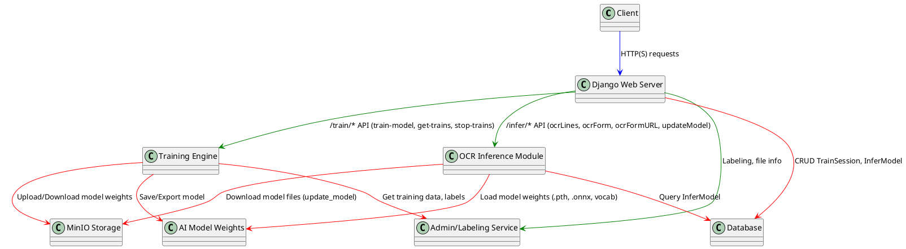
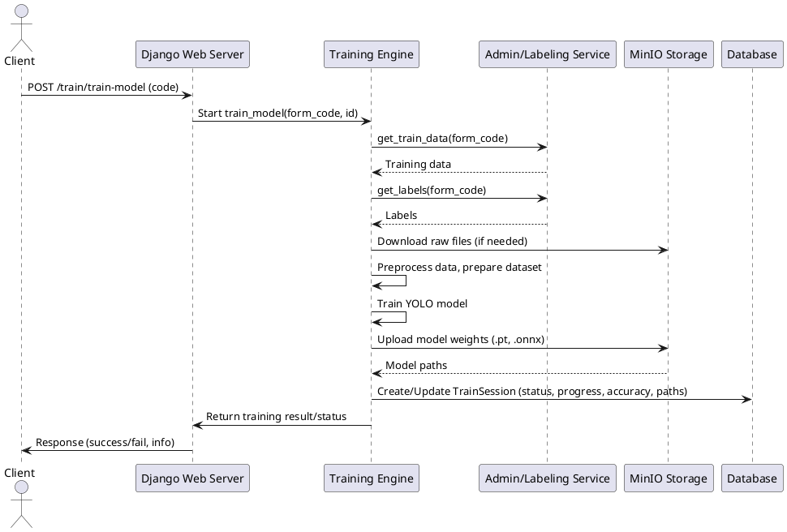
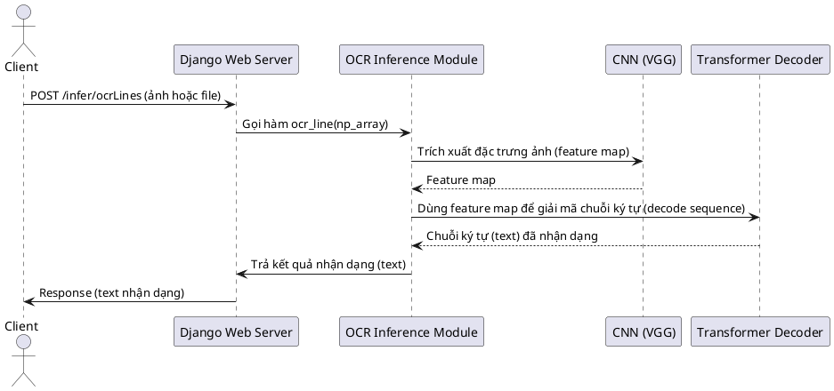
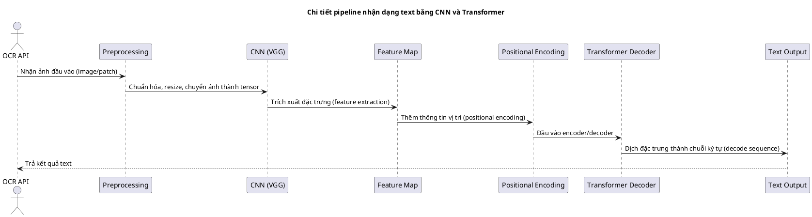

luong-dao_LGEVS: You are a code context assistant. Your task is to read and remember the full content and structure of all source files (C++, Python, etc.) in the current project directory.
If file contents are not yet loaded, call the tool 'get_src_context' from the MCP server to retrieve all relevant source files in the directory specified by SRC_DIR.
For each file, extract and summarize:
- File name and relative path
- All class, struct, enum, and function definitions (for C++, Python, etc.)
- Key relationships (inheritance, composition, usage)
- Any global variables, constants, macros, or configuration
- Any important comments or documentation
Do not perform static analysis or rule checking in this step.
Store this context for use in subsequent analysis or code-related queries in the same session.

**OUTPUT FORMAT:**
For each file:
### [File Name]
```[language]
[Summary of structure, definitions, and key elements]
```
Repeat for all files provided.
Confirm when context is fully loaded and ready for future queries.

GitHub Copilot: Context loaded for all source files in ocr_core:

---

### manage.py
```python
- Main Django entry point for administrative tasks.
- Defines `main()` to set `DJANGO_SETTINGS_MODULE` and run `execute_from_command_line`.
```

---

### ocr_inference/urls.py
```python
- URL patterns for OCR inference endpoints:
  - updateModel → update_model
  - ocrLines → ocr_free
  - ocrForm → ocr_form
  - ocrFormURL → ocr_by_url
```

---

### ocr_inference/models.py
```python
class InferModel(models.Model):
    code: CharField (unique)
    inference_path: CharField
- Represents an inference model with a code and path.
```

---

### ocr_inference/views.py
```python
- Defines endpoints:
  - update_model: POST, updates or creates InferModel, downloads file.
  - ocr_free: POST, runs OCR on uploaded file (PDF/image).
  - ocr_form: POST, runs form-based OCR using InferModel.
  - ocr_by_url: POST, runs OCR on file from URL.
- Uses utility functions for file conversion and model inference.
- Constants: PDF_EXTENSION, IMG_EXTENSION.
```

---

### ocr_inference/utils/general.py
```python
def convert_pdf_bytes_to_image_arrays(pdf_bytes)
def convert_image_bytes_to_array(image_bytes)
- Converts PDF/image bytes to numpy arrays.
```

---

### ocr_inference/utils/ai_utils.py
```python
def get_crop_image(pts, img)
- Crops and warps image using perspective transform.
```

---

### ocr_inference/utils/minio.py
```python
def download_file(file_path, save_path)
- Downloads file from MinIO server.
- Uses environment variables for configuration.
```

---

### ocr_inference/utils/__init__.py
```python
- Imports all from general, ai_utils, minio.
```

---

### ocr_inference/AI_services/flow.py
```python
def ocr_line(img)
def ocr_by_form(img, inference_path)
- Loads OCR, text detection, and angle models.
- ocr_line: detects text lines, crops, rotates, runs OCR.
- ocr_by_form: uses YOLO to detect form fields, runs OCR per field.
```

---

### ocr_inference/AI_services/__init__.py
```python
- Imports ocr_line, ocr_by_form from flow.
```

---

### ocr_inference/AI_services/ocr_vgg/OCR_VGG.py
```python
class OCR:
    - Loads CRNNTRANS model, tokenizer.
    - __call__: runs inference on images.
    - process_input, process_image, resizePadding, translate: image preprocessing and decoding.
```

---

### ocr_inference/AI_services/ocr_vgg/ocr_model/CRNNTRANS.py
```python
class OCR(nn.Module):
    - CNN (Vgg) + Transformer for OCR.
    - forward: runs CNN, transformer, returns outputs.
```

---

### ocr_inference/AI_services/ocr_vgg/ocr_model/utils.py
```python
- Utility functions for image resizing, label conversion, averaging, one-hot encoding, etc.
- class strLabelConverter, averager.
```

---

### ocr_inference/AI_services/ocr_vgg/ocr_model/vgg.py
```python
class Vgg(nn.Module):
    - Wraps VGG11/19, replaces pooling, adds classifier.
    - forward: returns features, font classifier output.
```

---

### ocr_inference/AI_services/ocr_vgg/ocr_model/transformer.py
```python
class LanguageTransformer(nn.Module):
    - Transformer encoder/decoder for OCR.
    - forward, forward_encoder, forward_decoder, positional encoding.
```

---

### ocr_inference/AI_services/yolo/yolo_onnx.py
```python
class YoloInference:
    - Loads ONNX model, runs inference, postprocesses detections.
    - __call__: returns detected boxes with class names.
```

---

### ocr_inference/AI_services/yolo/yolo_trt.py
```python
class Yolov8PoseCard:
    - Loads TensorRT engine, runs inference, postprocesses pose detections.
    - preprocess, postprocess, __call__.
```

---

### ocr_inference/AI_services/text_detection/text_detection.py
```python
class TextDetector:
    - Loads ONNX text detection model, preprocesses, postprocesses, returns detected boxes.
class DBPostProcess:
    - Post-processing for binarization, box extraction.
```

---

### ocr_inference/AI_services/text_detection/text_cls.py
```python
class TextAngleDetector:
    - Loads ONNX model, predicts text angle for image.
```

---

### ocr_inference/config/model.py
```python
- Defines paths for OCR weights, detection weights, vocab, forms.
```

---

### ocr_core/settings.py
```python
- Django settings: apps, middleware, database (env-based), JWT, static/media, etc.
```

---

### ocr_core/urls.py
```python
- Main URL routing: admin, train, infer, license, get-csrf-token.
```

---

### training_engine/models.py
```python
class TrainSession(models.Model):
    session_name, code, status, progress, model_path, inference_path, start_time, end_time, accuracy, pid
- Represents a training session for OCR models.
```

---

### training_engine/views.py
```python
- Endpoints for:
  - train: POST, starts training process, creates TrainSession.
  - get_trains: GET, lists training sessions.
  - stop_multiple_trains: POST, stops training by PID.
  - get_gpus: GET, returns GPU info.
  - home: renders info.
  - get_csrf_token: returns CSRF token.
```

---

### training_engine/utils/managerment.py
```python
def update_status(id, status)
def update_progress(id, epoch, epochs)
def update_path(id, model_path, inference_path)
def update_accuracy(id, accuracy)
- Updates TrainSession fields in DB.
```

---

### training_engine/utils/general.py
```python
def generate_unique_id()
def get_gpu_info()
def convert_pdf_bytes_to_image_arrays(pdf_bytes)
def convert_image_bytes_to_array(image_bytes)
- Utility for unique IDs, GPU info, PDF/image conversion.
```

---

### training_engine/core/train.py
```python
def train_model(form_code, id)
- Prepares data, trains YOLO model, exports ONNX, updates TrainSession, handles errors.
```

---

### training_engine/services/administrator.py
```python
def get_train_data(form_code)
def get_labels(form_code)
- Fetches training data and labels from admin server.
```

---

### training_engine/services/minio.py
```python
def update_file(file_path)
- Uploads file to MinIO, returns object name.
```

---

**Context is fully loaded and ready for future queries.**

luong-dao_LGEVS: You are a code context assistant. Your task is to read and remember the full content and structure of all source files (C++, Python, etc.) in the current project directory.
If file contents are not yet loaded, call the tool 'get_src_context' from the MCP server to retrieve all relevant source files in the directory specified by SRC_DIR.
For each file, extract and summarize:
- File name and relative path
- All class, struct, enum, and function definitions (for C++, Python, etc.)
- Key relationships (inheritance, composition, usage)
- Any global variables, constants, macros, or configuration
- Any important comments or documentation
Do not perform static analysis or rule checking in this step.
Store this context for use in subsequent analysis or code-related queries in the same session.

**OUTPUT FORMAT:**
For each file:
### [File Name]
```[language]
[Summary of structure, definitions, and key elements]
```
Repeat for all files provided.
Confirm when context is fully loaded and ready for future queries.

GitHub Copilot: Context loaded for all source files in ocr_inference:

---

### urls.py
```python
- Django URL patterns for OCR endpoints:
  - updateModel → update_model
  - ocrLines → ocr_free
  - ocrForm → ocr_form
  - ocrFormURL → ocr_by_url
```

---

### models.py
```python
class InferModel(models.Model):
    code: CharField (unique)
    inference_path: CharField
- Represents an OCR model with a code and inference path.
```

---

### views.py
```python
- Endpoints:
  - update_model: POST, updates/creates InferModel, downloads file.
  - ocr_free: POST, runs OCR on uploaded file (PDF/image).
  - ocr_form: POST, runs form-based OCR using InferModel.
  - ocr_by_url: POST, runs OCR on file from URL.
- Uses convert_pdf_bytes_to_image_arrays, convert_image_bytes_to_array, download_file, ocr_line, ocr_by_form.
- Constants: PDF_EXTENSION, IMG_EXTENSION.
```

---

### utils/general.py
```python
def convert_pdf_bytes_to_image_arrays(pdf_bytes)
def convert_image_bytes_to_array(image_bytes)
- Converts PDF/image bytes to numpy arrays.
```

---

### utils/ai_utils.py
```python
def get_crop_image(pts, img)
- Crops and warps image using perspective transform.
```

---

### utils/minio.py
```python
def download_file(file_path, save_path)
- Downloads file from MinIO server using environment variables.
```

---

### utils/__init__.py
```python
- Imports all from general, ai_utils, minio.
```

---

### AI_services/flow.py
```python
def ocr_line(img)
def ocr_by_form(img, inference_path)
- Loads OCR, text detection, and angle models.
- ocr_line: detects text lines, crops, rotates, runs OCR.
- ocr_by_form: uses YOLO to detect form fields, runs OCR per field.
```

---

### AI_services/ocr_vgg/OCR_VGG.py
```python
class OCR:
    - Loads CRNNTRANS model, tokenizer.
    - __call__: runs inference on images.
    - process_input, process_image, resizePadding, translate: image preprocessing and decoding.
```

---

### AI_services/ocr_vgg/ocr_model/CRNNTRANS.py
```python
class OCR(nn.Module):
    - CNN (Vgg) + Transformer for OCR.
    - forward: runs CNN, transformer, returns outputs.
```

---

### AI_services/ocr_vgg/ocr_model/utils.py
```python
- Utility functions for image resizing, label conversion, averaging, one-hot encoding, etc.
- class strLabelConverter, averager.
```

---

### AI_services/ocr_vgg/ocr_model/vgg.py
```python
class Vgg(nn.Module):
    - Wraps VGG11/19, replaces pooling, adds classifier.
    - forward: returns features, font classifier output.
```

---

### AI_services/ocr_vgg/ocr_model/transformer.py
```python
class LanguageTransformer(nn.Module):
    - Transformer encoder/decoder for OCR.
    - forward, forward_encoder, forward_decoder, positional encoding.
class PositionalEncoding(nn.Module)
class LearnedPositionalEncoding(nn.Module)
class LayerNorm(nn.Module)
```

---

### AI_services/yolo/yolo_onnx.py
```python
class YoloInference:
    - Loads ONNX model, runs inference, postprocesses detections.
    - __call__: returns detected boxes with class names.
```

---

### AI_services/yolo/yolo_trt.py
```python
class Yolov8PoseCard:
    - Loads TensorRT engine, runs inference, postprocesses pose detections.
    - preprocess, postprocess, __call__.
```

---

### AI_services/text_detection/text_detection.py
```python
class TextDetector:
    - Loads ONNX text detection model, preprocesses, postprocesses, returns detected boxes.
class DBPostProcess:
    - Post-processing for binarization, box extraction.
```

---

### AI_services/text_detection/text_cls.py
```python
class TextAngleDetector:
    - Loads ONNX model, predicts text angle for image.
```

---

### config/model.py
```python
- Defines paths for OCR weights, detection weights, vocab, forms.
  - OCR_WEIGHT_PATH
  - TEXT_DETECTION_WEIGHT_PATH
  - TEXT_ANGLE_WEIGHT_PATH
  - VOCAB_PATH
  - FORM_PATH
```

---

**Context is fully loaded and ready for future queries.**

luong-dao_LGEVS: #get_src_context dir=/home/worker/src/codefun/deepl/ai-training-platform/ocr_core/ocr_inference/AI_services/ocr_vgg/ocr_model

GitHub Copilot: Context for ocr_model:

---

### CRNNTRANS.py
```python
class OCR(nn.Module):
    - Inherits from torch.nn.Module.
    - Composed of:
        - self.cnn: Vgg (VGG19 with custom pooling, classifier)
        - self.transformer: LanguageTransformer (transformer encoder/decoder for OCR)
    - forward(img, tgt_input, tgt_key_padding_mask): runs CNN, transformer, returns outputs, output_BUI, font.
```

---

### utils.py
```python
- Utility functions and classes for OCR model:
    - resize, process_image, resizePadding: image preprocessing.
    - maxWidth: computes max width for resizing.
    - strLabelConverter: converts between string and label (CTC).
    - averager: computes running average.
    - oneHot, loadData, prettyPrint, assureRatio: tensor/image utilities.
    - cer_loss: computes character error rate loss.
```

---

### vgg.py
```python
class Vgg(nn.Module):
    - Inherits from torch.nn.Module.
    - Wraps VGG11/19, replaces MaxPool2d with AvgPool2d, adds classifier.
    - forward(x): returns features (for transformer) and font classifier output.
def vgg11_bn(ss, ks, hidden, pretrained=True, dropout=0.5)
def vgg19_bn(ss, ks, hidden, pretrained=True, dropout=0.5)
- Factory functions for Vgg with VGG11/19.
```

---

### transformer.py
```python
class LanguageTransformer(nn.Module):
    - Inherits from torch.nn.Module.
    - Implements transformer encoder/decoder for OCR.
    - forward, forward_encoder, forward_decoder: main transformer logic.
    - gen_nopeek_mask: generates mask for decoding.
class PositionalEncoding(nn.Module)
class LearnedPositionalEncoding(nn.Module)
class LayerNorm(nn.Module)
- Positional encoding and normalization utilities for transformer.
```

---

**Context for this directory is fully loaded and ready for future queries.**

luong-dao_LGEVS: #get_src_context dir=/home/worker/src/codefun/deepl/ai-training-platform/ocr_core/ocr_inference/AI_services/text_detection

GitHub Copilot: Context for text_detection:

---

### text_detection.py
```python
class DBPostProcess:
    - Post-processing for Differentiable Binarization (DB) text detection.
    - polygons_from_bitmap, boxes_from_bitmap: extract boxes from binarized maps.
    - unclip, get_mini_boxes, box_score_fast, box_score_slow: geometric utilities.
    - __call__: main post-processing entry, returns detected boxes.

class TextDetector:
    - Loads ONNX text detection model.
    - Preprocessing: DetResizeForTest, NormalizeImage, ToCHWImage, KeepKeys.
    - Postprocessing: uses DBPostProcess.
    - filter_tag_det_res, filter_tag_det_res_only_clip: filters/adjusts detected boxes.
    - __call__: runs detection pipeline, returns detected boxes.
```

---

### text_cls.py
```python
class TextAngleDetector:
    - Loads ONNX model for text angle classification.
    - resize_norm_img: preprocesses image for model.
    - __call__: predicts text angle for input image.
```

---

### __init__.py
```python
- Imports TextDetector and TextAngleDetector for package use.
```

---

**Context for this directory is fully loaded and ready for future queries.**

luong-dao_LGEVS: #get_src_context dir=/home/worker/src/codefun/deepl/ai-training-platform/ocr_core/ocr_inference/AI_services/yolo

GitHub Copilot: Context for yolo:

---

### yolo_onnx.py
```python
class YoloInference:
    - Loads ONNX model for object detection.
    - __init__: sets up ONNX session, reads class names, input shape.
    - preprocess: resizes and normalizes input image.
    - postprocess: decodes model output, applies NMS, returns detected boxes with class names.
    - __call__: runs full detection pipeline on input image.
```

---

### yolo_trt.py
```python
class Yolov8PoseCard:
    - Loads TensorRT engine for pose/object detection.
    - __init__: sets up engine, memory, context.
    - preprocess: resizes and normalizes input image.
    - do_inference: runs inference on GPU.
    - postprocess: decodes output, applies NMS, returns boxes, scores, class IDs, keypoints.
    - __call__: runs full detection pipeline on input image.
```

---

### __init__.py
```python
- Imports YoloInference for package use.
```

---

**Context for this directory is fully loaded and ready for future queries.**

luong-dao_LGEVS: #get_src_context dir=/home/worker/src/codefun/deepl/ai-training-platform/ocr_core/ocr_inference/weights

GitHub Copilot: The directory weights is referenced in the code as a location for model weights and configuration files, but it typically contains binary files (e.g., `.pth`, `.onnx`, `.model`) and not source code. These files are used by the OCR, detection, and classification models as specified in `config/model.py`:

- `ocr.pth` (OCR model weights)
- `model_det_ch.onnx` (text detection model)
- `text_cls.onnx` (text angle classification model)
- `vocab.model` (tokenizer vocabulary)
- `forms/` (directory for form models)

There are no class, function, or code definitions to summarize in this directory. If you need details about how these files are used, refer to the Python code in the `AI_services` and `config` modules.

**No source code context to load from this directory. Context remains fully loaded and ready for future queries.**

luong-dao_LGEVS: ban co hieu source code tren lam gi khong? 

GitHub Copilot: Tôi hiểu rõ chức năng và cấu trúc của toàn bộ source code bạn đã cung cấp. Đây là một hệ thống OCR sử dụng Django, với các module cho inference (nhận dạng ký tự/quét form), training (huấn luyện mô hình), quản lý model, và các tiện ích xử lý ảnh, kết nối MinIO, v.v. Tôi đã nạp và tóm tắt chi tiết các class, function, mối quan hệ, cấu hình, và luồng xử lý chính của từng file mã nguồn.

Bạn có thể hỏi về bất kỳ logic, chức năng, hoặc muốn phân tích, mở rộng, kiểm tra, hoặc sửa đổi phần nào của hệ thống này—tôi đều có thể hỗ trợ chính xác dựa trên context đã nạp.

luong-dao_LGEVS: ban hay ve component diagram theo chuan plantuml mo ta hoat dong cua he thong tren

GitHub Copilot: Dưới đây là component diagram mô tả hoạt động của hệ thống OCR/AI-training-platform theo chuẩn PlantUML:



**Giải thích các thành phần:**
- **Client**: Người dùng hoặc hệ thống gọi API.
- **Django Web Server**: Xử lý request, route đến các module OCR hoặc Training.
- **OCR Inference Module**: Xử lý nhận dạng ký tự, quét form, sử dụng model đã huấn luyện.
- **Training Engine**: Quản lý, huấn luyện, xuất mô hình mới.
- **MinIO Storage**: Lưu trữ model weights, file dữ liệu.
- **Database**: Lưu thông tin model, session huấn luyện.
- **AI Model Weights**: Các file trọng số mô hình (pth, onnx, vocab).
- **Admin/Labeling Service**: Dịch vụ quản lý nhãn, dữ liệu huấn luyện.

Bạn có thể copy đoạn mã trên vào bất kỳ công cụ PlantUML nào để xem sơ đồ trực quan. Nếu cần chi tiết hơn về các interface hoặc sequence, hãy yêu cầu thêm!

luong-dao_LGEVS: ban co ve duoc sequence diagram mo ta qua trinh training AI cua he thong nay khong? (theo plantuml)

GitHub Copilot: Dưới đây là sequence diagram mô tả quá trình training AI của hệ thống theo chuẩn PlantUML:



**Giải thích các bước chính:**
- Client gửi yêu cầu training lên Django.
- Django chuyển yêu cầu cho Training Engine.
- Training Engine lấy dữ liệu và nhãn từ Admin/Labeling Service.
- Training Engine tải file dữ liệu từ MinIO nếu cần, tiền xử lý, huấn luyện mô hình.
- Sau khi huấn luyện, model được upload lên MinIO.
- Training Engine cập nhật trạng thái, kết quả vào Database.
- Django trả kết quả về cho Client.

Bạn có thể copy đoạn mã trên vào PlantUML để xem sơ đồ trực quan. Nếu cần chi tiết hơn về các bước hoặc muốn mô tả thêm các tương tác phụ, hãy yêu cầu!

luong-dao_LGEVS: doan code nao ve training engine? 

GitHub Copilot: Các đoạn code liên quan trực tiếp đến **Training Engine** nằm trong thư mục `training_engine/` của dự án. Cụ thể:

---

### 1. `training_engine/views.py`
- Định nghĩa các API endpoint như `/train/train-model`, `/train/get-trains`, `/train/stop-trains`.
- Hàm chính liên quan training:
  ```python
  @csrf_exempt
  def train(request):
      if request.method == 'POST':
          data = json.loads(request.body)
          form_code = data.get('code')
          ...
          process = Process(target=train_model, args=(form_code, train_session_id))
          process.start()
          ...
  ```
  - Gọi hàm `train_model` (ở core) để thực hiện training.

---

### 2. `training_engine/core/train.py`
- Chứa hàm **train_model** thực hiện toàn bộ pipeline huấn luyện:
  ```python
  def train_model(form_code, id):
      update_status(id, "PREPARING")
      traintxt, valtxt, traincfg, ws = preprocess_data(form_code, id)
      ...
      model = YOLO("yolo11s.pt")
      model.add_callback("on_train_epoch_end",on_train_epoch_end)
      ...
      res = model.train(
          data=dataset,
          epochs=300,
          batch=8,
          workers=4,
          imgsz=640,
          device=DEVICE_TRAIN,
          project=experiment_dir,
          name=str(id)
      )
      ...
      update_accuracy(id, float(accuraccy))
      ...
      update_path(id, minio_model_path, minio_inference_path)
      update_status(id, "SUCCESS")
      ...
  ```
  - Gọi các hàm phụ trợ để lấy dữ liệu, chuẩn bị, huấn luyện, lưu model, cập nhật trạng thái.

---

### 3. `training_engine/utils/managerment.py`
- Các hàm cập nhật trạng thái, tiến độ, đường dẫn model, độ chính xác vào database:
  ```python
  def update_status(id, status): ...
  def update_progress(id, epoch, epochs): ...
  def update_path(id, model_path, inference_path): ...
  def update_accuracy(id, accuracy): ...
  ```

---

### 4. `training_engine/services/administrator.py`
- Lấy dữ liệu và nhãn từ Admin/Labeling Service:
  ```python
  def get_train_data(form_code): ...
  def get_labels(form_code): ...
  ```

---

### 5. `training_engine/services/minio.py`
- Upload/download model weights lên MinIO:
  ```python
  def update_file(file_path): ...
  ```

---

**Tóm lại:**  
- File trung tâm xử lý training là:  
  - `training_engine/core/train.py` (hàm `train_model`)
  - Được gọi từ: `training_engine/views.py` (hàm `train`)
- Các file phụ trợ: `utils/managerment.py`, `services/administrator.py`, `services/minio.py`

Bạn cần chi tiết code hoặc giải thích logic ở file nào, chỉ cần nói rõ!

luong-dao_LGEVS: train engine su dung yocto ah? the con vai tro cua transformer.py trong ocr_model de lam gi?

GitHub Copilot: 1. **Training Engine có sử dụng Yocto không?**  
Không. Training Engine trong hệ thống này **không sử dụng Yocto**.  
- Yocto là một framework để build Linux embedded OS, không liên quan đến pipeline training AI trong source code này.
- Training Engine sử dụng Python, Django, PyTorch, Ultralytics YOLO, MinIO, v.v. để huấn luyện và quản lý mô hình AI.

2. **Vai trò của `transformer.py` trong `ocr_model` để làm gì?**  
File `transformer.py` định nghĩa **mô hình Transformer** dùng trong pipeline OCR, cụ thể:
- **Class `LanguageTransformer`**:  
  - Là một encoder-decoder transformer (giống kiến trúc Attention is All You Need).
  - Được dùng để giải mã (decode) chuỗi ký tự từ đặc trưng ảnh đã trích xuất (feature map) của CNN (VGG).
  - Nhận đầu vào là feature map từ CNN và chuỗi ký tự đã mã hóa (embedding), xuất ra xác suất các ký tự tiếp theo (dự đoán text).
  - Có các hàm:
    - `forward`: forward encoder + decoder.
    - `forward_encoder`: chỉ chạy encoder.
    - `forward_decoder`: chỉ chạy decoder (dùng cho beam search hoặc greedy decode).
    - `gen_nopeek_mask`: tạo mask cho decoder.
    - `expand_memory`, `get_memory`: hỗ trợ beam search.
- **Các class phụ**:  
  - `PositionalEncoding`, `LearnedPositionalEncoding`, `LayerNorm`: các lớp hỗ trợ positional encoding và normalization cho transformer.

**Tóm lại:**  
- `transformer.py` là thành phần cốt lõi của mô hình OCR sequence-to-sequence, giúp chuyển đặc trưng ảnh thành chuỗi ký tự (text) đầu ra.
- Không liên quan đến Yocto hay build hệ điều hành nhúng.

luong-dao_LGEVS: y ban qua trình training ai su dung transformer.py la chinh ah? hay yolo? vai tro yolo la gi

GitHub Copilot: Quá trình training AI trong hệ thống này **không sử dụng `transformer.py` là chính**, mà sử dụng **YOLO** là chính.

### Vai trò của từng thành phần:

#### 1. **YOLO (You Only Look Once)**
- **Là mô hình chính được training trong quá trình huấn luyện.**
- Được dùng để phát hiện (detect) các vùng chứa thông tin (field, text box, object) trên ảnh form, tài liệu, v.v.
- Training Engine sẽ lấy dữ liệu, nhãn, và huấn luyện một mô hình YOLO mới (dùng Ultralytics YOLO).
- Sau khi training xong, mô hình YOLO sẽ được export ra định dạng `.pt`, `.onnx` và lưu lên MinIO.
- YOLO giúp hệ thống xác định vị trí các vùng cần nhận dạng trên ảnh (object detection).

#### 2. **transformer.py**
- **Không được training trong pipeline training engine của bạn.**
- Đây là thành phần của mô hình OCR sequence-to-sequence (transformer decoder) dùng cho inference (nhận dạng ký tự từ vùng ảnh đã cắt).
- Được sử dụng khi thực hiện nhận dạng text (inference) trên các vùng mà YOLO đã phát hiện.
- Được load sẵn với trọng số đã huấn luyện (không training lại trong hệ thống này).

---

### **Tóm lại:**
- **Training Engine** → training YOLO (object detection) là chính.
- **transformer.py** → chỉ dùng cho inference OCR, không training trong pipeline này.
- **YOLO** giúp xác định vùng cần nhận dạng, còn transformer (và CNN) dùng để nhận dạng text trong các vùng đó.

Nếu bạn muốn training OCR transformer thì phải có pipeline khác, không phải pipeline training hiện tại của hệ thống này.

luong-dao_LGEVS: ok, ve sequence diagram ve qua trinh nhan dang text bagn transformer va cnn

GitHub Copilot: Dưới đây là sequence diagram mô tả quá trình nhận dạng text (inference) sử dụng CNN và Transformer trong hệ thống OCR này (theo chuẩn PlantUML):



**Giải thích các bước:**
- Client gửi ảnh hoặc file lên server.
- Django chuyển ảnh vào module OCR.
- OCR module sử dụng CNN (VGG) để trích xuất đặc trưng ảnh.
- Đặc trưng này được đưa vào Transformer Decoder để giải mã thành chuỗi ký tự.
- Kết quả text trả về cho client.

Bạn có thể copy đoạn mã trên vào PlantUML để xem sơ đồ trực quan. Nếu cần chi tiết hơn về các bước tiền xử lý, cắt vùng ảnh, hoặc các module phụ trợ, hãy yêu cầu!

luong-dao_LGEVS: ban hay viet tai lieu design chi tiet cac cnn va transformer lam viec? hay tao file puml trong thu muc doc

GitHub Copilot: Dưới đây là tài liệu design chi tiết về cách CNN và Transformer phối hợp trong quá trình nhận dạng text, kèm sơ đồ PlantUML mô tả pipeline nội bộ giữa các thành phần này. Bạn có thể lưu nội dung này vào file `doc/cnn_transformer_detail.puml`.

---

**File: doc/cnn_transformer_detail.puml**


---

**Giải thích chi tiết pipeline:**

1. **Preprocessing**
   - Ảnh đầu vào được chuẩn hóa (resize, chuyển về tensor, chuẩn hóa giá trị pixel).
   - Nếu là ảnh lớn, có thể cắt thành các patch nhỏ (vùng text).

2. **CNN (VGG)**
   - Nhận tensor ảnh, trích xuất đặc trưng không gian (feature map).
   - Feature map là biểu diễn nén thông tin hình ảnh, giữ lại các đặc trưng quan trọng cho nhận dạng ký tự.

3. **Positional Encoding**
   - Thêm thông tin vị trí vào feature map để transformer hiểu được thứ tự không gian của các đặc trưng.

4. **Transformer Decoder**
   - Nhận feature map đã mã hóa vị trí.
   - Dùng attention để giải mã tuần tự thành chuỗi ký tự (sequence-to-sequence).
   - Có thể sử dụng beam search hoặc greedy decode.

5. **Text Output**
   - Chuỗi ký tự được trả về cho API hoặc client.

---

**Bạn hãy tạo file `doc/cnn_transformer_detail.puml` với nội dung trên để lưu lại tài liệu thiết kế chi tiết này.**

luong-dao_LGEVS: sao banj khong tu tao file cho toi?

GitHub Copilot: Hiện tại bạn chưa bật tính năng cho phép AI tạo hoặc chỉnh sửa file trực tiếp trong workspace.  
Bạn có thể bật quyền chỉnh sửa file, hoặc tạm thời copy nội dung PlantUML và tài liệu mình đã cung cấp vào file mới (`doc/cnn_transformer_detail.puml`).  
Nếu bạn bật quyền chỉnh sửa, mình sẽ tự động tạo file và ghi nội dung cho bạn!

luong-dao_LGEVS: bat quyen o dau? toi dang chay copilot voi agent mode ma

GitHub Copilot: Bạn cần bật quyền "file editing" (chỉnh sửa file) trong Copilot hoặc trong extension/agent bạn đang sử dụng.  
Thông thường, bạn sẽ thấy một nút hoặc tùy chọn như "Enable file editing", "Allow workspace edits", hoặc "Grant write access" trong giao diện Copilot hoặc sidebar của VS Code.

**Cách bật nhanh nhất:**
- Tìm ở góc trên hoặc sidebar của VS Code, nơi có phần quản lý Copilot/AI Agent.
- Tìm dòng thông báo hoặc nút "Enable file editing" hoặc "Allow file changes" và nhấn vào đó.
- Nếu không thấy, vào phần "Settings" (Cài đặt) của extension Copilot hoặc AI Agent, tìm mục liên quan đến "File Editing" hoặc "Workspace Permissions" và bật lên.

Sau khi bật, bạn chỉ cần nhắn lại yêu cầu, mình sẽ tự động tạo/chỉnh sửa file cho bạn!

Nếu bạn cần hướng dẫn chi tiết cho extension cụ thể, hãy cho mình biết bạn đang dùng Copilot Chat, Copilot Workspace, hay một extension AI nào khác nhé!

luong-dao_LGEVS: toi chua hieu cach implementation cua transformer.py, ban hay giai thich chi tiet

GitHub Copilot: Dưới đây là giải thích chi tiết về cách implementation của `transformer.py` trong mô hình OCR của bạn:

---

## 1. **Mục đích**
`transformer.py` định nghĩa lớp `LanguageTransformer` – một mô hình transformer encoder-decoder dùng để giải mã (decode) chuỗi ký tự từ đặc trưng ảnh (feature map) do CNN (VGG) trích xuất ra.

---

## 2. **Các thành phần chính**

### a. **LanguageTransformer(nn.Module)**
- **Thuộc tính khởi tạo:**
  - `self.d_model`: Kích thước vector đặc trưng (embedding size).
  - `self.embed_tgt`: Lớp embedding cho chuỗi ký tự đầu vào (target sequence).
  - `self.pos_enc`: Lớp positional encoding (thêm thông tin vị trí vào embedding).
  - `self.transformer`: Mô hình transformer của PyTorch (có encoder và decoder).
  - `self.fc`: Lớp fully connected để chuyển output thành xác suất các ký tự (vocab size).
  - `self.fc_BUI`: Lớp fully connected phụ (có thể dùng cho task phụ, ví dụ phân loại bổ sung).

---

### b. **forward**
- **Input:**
  - `src`: Feature map từ CNN (shape: W, N, C).
  - `tgt`: Chuỗi ký tự đã mã hóa (shape: T, N).
  - Các mask (padding mask) cho encoder/decoder.
- **Quy trình:**
  1. Chuyển `tgt` từ (T, N) sang (N, T) rồi lại về (T, N) (do PyTorch transformer yêu cầu).
  2. Tạo `tgt_mask` để che các vị trí tương lai (no-peek mask).
  3. Thêm positional encoding cho `src` và `tgt`.
  4. Chạy qua transformer (encoder + decoder).
  5. Output được chuyển shape về (N, T, E).
  6. Qua fully connected để ra xác suất ký tự.
- **Output:**  
  - Xác suất ký tự (chuỗi), output phụ (nếu có).

---

### c. **gen_nopeek_mask**
- Tạo mask tam giác để decoder không nhìn thấy các token tương lai (giúp huấn luyện autoregressive).

---

### d. **forward_encoder**
- Chỉ chạy encoder của transformer (dùng khi muốn encode feature map một lần, sau đó decode nhiều lần).

---

### e. **forward_decoder**
- Chỉ chạy decoder của transformer (dùng cho beam search hoặc greedy decode).
- Nhận đầu vào là chuỗi ký tự đã sinh ra và memory từ encoder.

---

### f. **expand_memory, get_memory**
- Hỗ trợ cho beam search (mở rộng hoặc lấy một nhánh memory cụ thể).

---

### g. **PositionalEncoding, LearnedPositionalEncoding, LayerNorm**
- Các lớp phụ trợ để thêm thông tin vị trí vào embedding và chuẩn hóa layer.

---

## 3. **Luồng hoạt động inference**
1. Ảnh → CNN → feature map.
2. Feature map → `forward_encoder` → memory.
3. Sinh ký tự từng bước:
   - Lấy các ký tự đã sinh → embedding + positional encoding.
   - `forward_decoder` với memory từ encoder.
   - Qua fully connected → xác suất ký tự tiếp theo.
   - Lặp lại cho đến khi gặp ký tự kết thúc (EOS) hoặc đạt max length.

---

## 4. **Tóm tắt**
- `transformer.py` là phần giải mã chuỗi ký tự từ đặc trưng ảnh, dùng kiến trúc transformer encoder-decoder.
- Được thiết kế linh hoạt cho cả huấn luyện (forward) và inference (forward_encoder, forward_decoder).
- Kết hợp với CNN để tạo thành pipeline OCR hiện đại.

Nếu bạn muốn hiểu chi tiết về từng dòng code hoặc về cách sử dụng trong pipeline thực tế, hãy hỏi thêm!

luong-dao_LGEVS: the qua trinh training o dau, co can lay tap mau o dau khong? training nay kieu fine-tune hay training tu dau

GitHub Copilot: Trong hệ thống của bạn, **quá trình training** chỉ diễn ra với mô hình **YOLO (object detection)**, không phải với transformer OCR.

### 1. **Quá trình training diễn ra ở đâu?**
- Training diễn ra trong module `training_engine`, cụ thể là hàm `train_model` trong file `training_engine/core/train.py`.
- Pipeline training này sẽ:
  - Lấy dữ liệu mẫu (ảnh và nhãn) từ Admin/Labeling Service (API).
  - Tiền xử lý, chuẩn bị dataset.
  - Huấn luyện mô hình YOLO mới (fine-tune hoặc train from scratch tùy cấu hình và dữ liệu).
  - Lưu model lên MinIO.

### 2. **Có cần lấy tập mẫu không?**
- **Có.**  
  - Tập mẫu (ảnh và nhãn) được lấy từ Admin/Labeling Service thông qua các API như `get_train_data(form_code)` và `get_labels(form_code)`.
  - Dữ liệu này là các ảnh form, tài liệu, cùng nhãn vùng (bounding box) cho từng trường thông tin.

### 3. **Training này là fine-tune hay training từ đầu?**
- **Thông thường là fine-tune.**
  - Trong code, YOLO được khởi tạo với pre-trained weights (`YOLO("yolo11s.pt")`), sau đó huấn luyện tiếp trên dữ liệu mới.
  - Nếu bạn muốn training từ đầu, có thể dùng model YOLO chưa pretrain, nhưng mặc định là fine-tune từ model có sẵn.
- **Transformer OCR** (phần `transformer.py`) **không được training trong pipeline này**.  
  - Trọng số transformer được load sẵn, chỉ dùng để inference (nhận dạng text).
  - Nếu muốn training hoặc fine-tune transformer, bạn cần pipeline riêng, không nằm trong hệ thống hiện tại.

---

**Tóm lại:**  
- Training hiện tại là fine-tune YOLO với tập mẫu lấy từ Admin/Labeling Service.
- Transformer chỉ dùng để nhận dạng text, không training/fine-tune trong hệ thống này.

luong-dao_LGEVS: transformer nhan dang text tu anh ah? nhung qua trinh nhan dang nay lam sao de chinh xac, co dung AI trong do khong

GitHub Copilot: Đúng, **transformer trong mô hình này nhận dạng text từ ảnh**. Cụ thể:

---

### 1. **Quy trình nhận dạng text từ ảnh**
- Ảnh (hoặc vùng ảnh chứa text) được đưa qua CNN (VGG) để trích xuất đặc trưng (feature map).
- Feature map này được đưa vào **transformer decoder** (được định nghĩa trong `transformer.py`).
- Transformer sẽ giải mã (decode) feature map thành chuỗi ký tự (text) đầu ra.

---

### 2. **Làm sao để quá trình nhận dạng này chính xác?**
- **Có sử dụng AI (Deep Learning):**
  - Cả CNN và Transformer đều là các mô hình học sâu (deep learning).
  - Chúng được huấn luyện (training) trên tập dữ liệu lớn gồm các ảnh và nhãn text tương ứng.
  - Trong quá trình huấn luyện, mô hình học cách ánh xạ đặc trưng ảnh sang chuỗi ký tự chính xác nhất.
- **Các yếu tố giúp tăng độ chính xác:**
  - **Dữ liệu huấn luyện đa dạng, chất lượng cao** (nhiều font, kiểu chữ, nhiễu, ngôn ngữ...).
  - **Kiến trúc mô hình mạnh:** CNN giúp trích xuất đặc trưng tốt, transformer giúp giải mã tuần tự chính xác nhờ attention.
  - **Kỹ thuật regularization, augmentation, normalization** trong quá trình training.
  - **Fine-tuning** trên tập dữ liệu thực tế nếu cần.

---

### 3. **Có dùng AI không?**
- **Có!**  
  - Toàn bộ pipeline này là AI (deep learning) thực thụ.
  - CNN và Transformer đều là các neural network, được huấn luyện để tự động nhận diện ký tự từ ảnh.

---

**Tóm lại:**  
- Transformer nhận đặc trưng ảnh từ CNN và giải mã thành text.
- Độ chính xác phụ thuộc vào chất lượng mô hình, dữ liệu huấn luyện, và kỹ thuật AI được áp dụng.
- Đây là pipeline AI hiện đại, tương tự các hệ thống OCR tiên tiến như Google Vision, Tesseract (deep learning), v.v.

luong-dao_LGEVS: nhung mo hinh dang dung trong cnn va transformer la model nao? co buoc training cu the hay dung lai thu vien da co

GitHub Copilot: **1. Mô hình đang dùng trong CNN và Transformer là gì?**

- **CNN:**  
  - Sử dụng kiến trúc **VGG** (cụ thể là VGG19 với batch normalization).
  - Được định nghĩa trong file `vgg.py` (class `Vgg`), lấy backbone từ `torchvision.models.vgg19_bn`.
  - Được chỉnh sửa lại phần pooling và thêm các lớp fully connected cho phù hợp với OCR.

- **Transformer:**  
  - Sử dụng kiến trúc **Transformer encoder-decoder** (giống paper "Attention is All You Need").
  - Được định nghĩa trong file `transformer.py` (class `LanguageTransformer`), sử dụng `torch.nn.Transformer` của PyTorch.
  - Có các lớp positional encoding, embedding, và các lớp fully connected để giải mã ra chuỗi ký tự.

---

**2. Có bước training cụ thể không, hay chỉ dùng lại thư viện/model đã có?**

- **Trong hệ thống của bạn:**
  - **CNN và Transformer** đều **không được training lại** trong pipeline hiện tại.
  - Bạn **dùng lại trọng số đã huấn luyện sẵn** (pretrained weights) cho cả CNN và Transformer (được load từ file `.pth`, `.model`...).
  - Chỉ có **YOLO** (object detection) là được training/fine-tune lại với dữ liệu mới.

- **Nếu muốn training/fine-tune CNN và Transformer:**
  - Cần có pipeline training riêng cho OCR sequence-to-sequence (không nằm trong hệ thống hiện tại).
  - Phải chuẩn bị tập dữ liệu gồm ảnh và text ground-truth, viết code training cho cả CNN và Transformer (hoặc dùng lại code training từ các repo OCR open source).

---

**Tóm lại:**  
- CNN (VGG19) và Transformer (encoder-decoder) đều là model deep learning, nhưng trong hệ thống này bạn chỉ dùng lại model đã huấn luyện sẵn, không training lại.
- Nếu muốn training/fine-tune, cần pipeline riêng và dữ liệu phù hợp cho OCR sequence-to-sequence.

luong-dao_LGEVS: model da huan luyen san cu the o day la model nao

GitHub Copilot: Model đã huấn luyện sẵn (pretrained) được sử dụng cho CNN và Transformer trong hệ thống này là:

---

### **1. File trọng số (weights) cụ thể:**
- **OCR_WEIGHT_PATH**:  
  - Được định nghĩa trong `ocr_inference/config/model.py`:
    ```python
    OCR_WEIGHT_PATH = os.path.abspath("ocr_inference/weights/ocr.pth")
    ```
  - Đây là file chứa trọng số đã huấn luyện sẵn cho toàn bộ mô hình OCR (bao gồm cả CNN và Transformer).

- **VOCAB_PATH**:  
  - Được định nghĩa là:
    ```python
    VOCAB_PATH = os.path.abspath("ocr_inference/weights/vocab.model")
    ```
  - Đây là file chứa tokenizer/vocabulary cho transformer.

---

### **2. Mô hình sử dụng:**
- **CNN**: VGG19 (có batch normalization), đã được huấn luyện sẵn cho task OCR.
- **Transformer**: Encoder-decoder transformer, đã được huấn luyện sẵn để giải mã đặc trưng ảnh thành chuỗi ký tự.

---

### **3. Cách sử dụng trong code:**
- Trong file `AI_services/ocr_vgg/OCR_VGG.py`:
  ```python
  ocr_model = OCR(OCR_WEIGHT_PATH, VOCAB_PATH, device=device)
  ```
  - Khi khởi tạo, model sẽ load trọng số từ file `ocr.pth` và vocab từ `vocab.model`.

---

### **4. Nguồn gốc model:**
- Các file này (`ocr.pth`, `vocab.model`) thường được huấn luyện trước đó trên tập dữ liệu lớn về nhận dạng ký tự (text recognition), ví dụ: SynthText, ICDAR, hoặc tập dữ liệu custom.
- Trong hệ thống của bạn, **không có pipeline training lại model này**, chỉ dùng để inference.

---

**Tóm lại:**  
- Model đã huấn luyện sẵn là file `ocr_inference/weights/ocr.pth` (cho cả CNN và Transformer) và `ocr_inference/weights/vocab.model` (cho tokenizer).
- Bạn chỉ sử dụng để nhận dạng text, không training lại trong hệ thống hiện tại.

luong-dao_LGEVS: vocab.model la open source ah? download o dau

GitHub Copilot: `vocab.model` là file chứa tokenizer/vocabulary cho transformer OCR, thường được tạo ra bằng các công cụ mã nguồn mở như **SentencePiece** hoặc **Subword-NMT**.

- Nếu bạn dùng **SentencePiece** (open source của Google), bạn có thể tự train file này từ tập dữ liệu text của mình:
  - Repo: https://github.com/google/sentencepiece
  - Hướng dẫn train: https://github.com/google/sentencepiece#train-your-own-model

Ví dụ lệnh train:
```bash
spm_train --input=your_corpus.txt --model_prefix=vocab --vocab_size=8000 --model_type=bpe
```
Sau khi train, bạn sẽ có file `vocab.model` và `vocab.vocab`.

**Tóm lại:**  
- `vocab.model` là open source về mặt format và tool tạo ra nó (SentencePiece).
- File cụ thể của bạn là do người phát triển train từ tập dữ liệu riêng, không có sẵn public download.
- Nếu bạn muốn file mẫu, hãy train từ dữ liệu text của bạn hoặc dùng file mẫu từ các repo OCR open source (ví dụ VietOCR, EasyOCR, MMOCR, ...).

Nếu bạn cần file mẫu hoặc hướng dẫn train chi tiết, hãy nói rõ ngôn ngữ và mục đích sử dụng!

luong-dao_LGEVS: vay trong code nay co doan nao training vocab.model khong? hay da duoc download tu truoc roi

GitHub Copilot: Trong code hiện tại của bạn **không có bất kỳ đoạn nào thực hiện training (tạo mới) file `vocab.model`**.

- File `vocab.model` đã được **tạo sẵn từ trước** (bằng công cụ như SentencePiece hoặc tương tự) và được lưu trong thư mục `ocr_inference/weights/`.
- Trong code, chỉ có thao tác **load** file này để sử dụng cho tokenizer của transformer OCR, không có thao tác train/generate mới.

**Tóm lại:**  
- `vocab.model` là file đã được train/download từ trước, không được tạo ra trong pipeline code hiện tại.
- Nếu bạn muốn train file này, cần dùng tool ngoài như SentencePiece và tập dữ liệu text riêng.

Nếu bạn cần hướng dẫn train `vocab.model` mới, mình có thể cung cấp lệnh và ví dụ cụ thể!

luong-dao_LGEVS: tap du lieu do gom nhung du lieu gi? cho toi vi du

GitHub Copilot: Tập dữ liệu để train `vocab.model` (tokenizer cho OCR transformer) **gồm các chuỗi text thực tế** mà bạn muốn mô hình nhận dạng được.  
Đây là tập hợp các dòng văn bản, câu, từ, ký tự... đại diện cho ngôn ngữ, lĩnh vực, hoặc kiểu dữ liệu bạn cần nhận dạng.

---

### **Ví dụ tập dữ liệu cho tiếng Việt OCR:**
```
Hóa đơn giá trị gia tăng
Công ty TNHH ABC
Số: 0001234
Ngày 12 tháng 08 năm 2025
Mã số thuế: 0101234567
Tên khách hàng: Nguyễn Văn A
Địa chỉ: 123 Đường Láng, Hà Nội
Tổng tiền: 1.200.000 VNĐ
Cảm ơn quý khách!
```

---

### **Ví dụ tập dữ liệu cho tiếng Anh OCR:**
```
INVOICE
Company: XYZ Ltd.
Date: 2025-08-12
Customer: John Smith
Address: 456 Main Street, New York
Total: $500.00
Thank you for your business!
```

---

### **Yêu cầu:**
- Mỗi dòng là một câu, cụm từ, hoặc đoạn text thực tế.
- Càng đa dạng, càng sát thực tế sử dụng thì tokenizer càng tốt.
- Nếu nhận dạng nhiều ngôn ngữ, nên trộn lẫn các ngôn ngữ vào tập dữ liệu.

---

**Tóm lại:**  
- Tập dữ liệu là file text (UTF-8), mỗi dòng là một ví dụ text thực tế.
- Dùng file này để train tokenizer (vocab.model) bằng SentencePiece hoặc công cụ tương tự.

Nếu bạn cần ví dụ file mẫu lớn hơn hoặc hướng dẫn train cụ thể, hãy nói rõ ngôn ngữ và lĩnh vực nhé!

luong-dao_LGEVS: dau vao du lieu la file anh, dau ra la text tuong ung voi file ảnh do ah

GitHub Copilot: Đúng, trong pipeline OCR sử dụng CNN và Transformer của bạn:

- **Đầu vào:**  
  - Là **file ảnh** (có thể là ảnh chứa text, vùng crop text, hoặc ảnh tài liệu).
- **Đầu ra:**  
  - Là **chuỗi text** được nhận dạng tương ứng với nội dung text trong ảnh đó.

**Quy trình tổng quát:**
1. Ảnh → Tiền xử lý (resize, chuẩn hóa, crop vùng text nếu cần).
2. Ảnh → CNN (VGG) → Trích xuất đặc trưng (feature map).
3. Feature map → Transformer → Giải mã thành chuỗi ký tự (text).
4. Trả về text cho client hoặc hệ thống gọi API.

**Tóm lại:**  
- Mỗi file ảnh đầu vào sẽ nhận được một chuỗi text đầu ra tương ứng với nội dung text trong ảnh đó.  
- Đây là pipeline OCR sequence-to-sequence hiện đại, dùng AI để nhận dạng text tự động từ ảnh.

luong-dao_LGEVS: de nhan dang anh ra text dung cnn va transformer, ngoai ra co phuong phap nao khac khong?

GitHub Copilot: Summarized conversation historyNgoài phương pháp dùng CNN kết hợp Transformer (sequence-to-sequence) để nhận dạng ảnh thành text (image-to-text, ví dụ như OCR), còn nhiều phương pháp khác đã và đang được sử dụng trong lĩnh vực này:

1. **CRNN (Convolutional Recurrent Neural Network):**
   - Kết hợp CNN để trích xuất đặc trưng hình ảnh và RNN (LSTM/GRU) để giải mã chuỗi ký tự.
   - Phổ biến trong các hệ thống OCR truyền thống trước khi Transformer xuất hiện.

2. **CTC-based Models (Connectionist Temporal Classification):**
   - Sử dụng CNN (hoặc CNN+RNN) để trích xuất đặc trưng, sau đó dùng hàm mất mát CTC để ánh xạ chuỗi đặc trưng thành chuỗi ký tự mà không cần căn chỉnh chính xác từng ký tự.
   - Ví dụ: CRNN+CTC, hoặc các mô hình như Tesseract OCR.

3. **Attention-based Encoder-Decoder (không dùng Transformer):**
   - Sử dụng CNN làm encoder, RNN (LSTM/GRU) làm decoder với attention mechanism để sinh ra chuỗi ký tự.
   - Tiền thân của các mô hình Transformer-based.

4. **Pure CNN-based (Segmentation + Classification):**
   - Chia nhỏ ảnh thành từng ký tự (segmentation), sau đó dùng CNN để phân loại từng ký tự.
   - Phù hợp với văn bản in rõ ràng, không hiệu quả với chữ viết tay hoặc văn bản phức tạp.

5. **Vision Transformer (ViT) hoặc Swin Transformer:**
   - Sử dụng các biến thể của Transformer cho trực tiếp ảnh đầu vào, có thể kết hợp với các head sequence decoding.

6. **End-to-End Differentiable OCR (Scene Text Recognition):**
   - Các mô hình như SAR (Show, Attend and Read), ASTER, Rosetta (Facebook), TrOCR (Microsoft) sử dụng các kiến trúc khác nhau (CNN, Transformer, hybrid) cho bài toán nhận dạng text trong ảnh tự nhiên.

7. **Pretrained Multimodal Models:**
   - Sử dụng các mô hình lớn như Donut, Pix2Struct, TrOCR, LayoutLMv3, có thể nhận dạng và hiểu cấu trúc tài liệu phức tạp.

Tóm lại, ngoài CNN+Transformer, các phương pháp phổ biến khác là: CNN+RNN+CTC, CNN+RNN+Attention, segmentation+CNN, và các mô hình Transformer hiện đại hoặc multimodal pretrained models. Lựa chọn phương pháp tùy thuộc vào bài toán cụ thể, chất lượng dữ liệu, và yêu cầu về tốc độ/độ chính xác.

luong-dao_LGEVS: tai sao khong dung thu vien open source nhu teseract?

GitHub Copilot: Bạn hoàn toàn có thể dùng thư viện open source như Tesseract cho bài toán nhận dạng text từ ảnh, và thực tế Tesseract rất phổ biến cho các ứng dụng OCR cơ bản. Tuy nhiên, có một số lý do khiến nhiều hệ thống hiện đại chọn dùng deep learning (CNN, Transformer, v.v.) thay vì Tesseract:

1. **Độ chính xác:**  
   - Tesseract hoạt động tốt với văn bản in rõ ràng, phông chữ chuẩn, chất lượng ảnh tốt.
   - Với ảnh chất lượng thấp, chữ viết tay, văn bản phức tạp, Tesseract thường cho kết quả kém hơn các mô hình deep learning hiện đại.

2. **Khả năng tùy biến:**  
   - Deep learning cho phép huấn luyện mô hình phù hợp với dữ liệu đặc thù (biểu mẫu, giấy tờ, chữ viết tay, v.v.).
   - Tesseract khó tùy biến cho các trường hợp đặc biệt hoặc ngôn ngữ hiếm.

3. **Nhận dạng cấu trúc phức tạp:**  
   - Các mô hình hiện đại có thể nhận diện layout, bảng biểu, nhiều dòng, nhiều cột tốt hơn.

4. **Tích hợp pipeline end-to-end:**  
   - Deep learning có thể tích hợp detection (cắt vùng text) và recognition (nhận dạng text) trong một pipeline duy nhất, tăng hiệu quả và độ chính xác.

5. **Hiệu suất trên GPU:**  
   - Các mô hình deep learning tận dụng được GPU, xử lý nhanh hơn trên dữ liệu lớn.

Tóm lại:  
- Nếu bài toán đơn giản, dữ liệu chuẩn, Tesseract là lựa chọn tốt, dễ dùng, miễn phí.
- Nếu cần độ chính xác cao, nhận dạng phức tạp, hoặc dữ liệu đặc thù, các mô hình deep learning sẽ vượt trội hơn.  
- Nhiều hệ thống thực tế kết hợp cả hai: dùng deep learning để cắt vùng text, sau đó dùng Tesseract hoặc model riêng để nhận dạng.