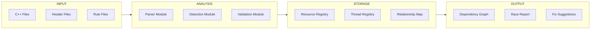

# Technical Architecture

```mermaid
flowchart LR
    INPUT[Input Layer] --> ANALYSIS[Analysis Layer]
    ANALYSIS --> STORAGE[Storage Layer]
    STORAGE --> OUTPUT[Output Layer]
    
    subgraph INPUT
        CPP[C++ Files]
        HDR[Header Files]
        RULES[Rule Files]
    end
    
    subgraph ANALYSIS
        PARSE[Parser Module]
        DETECT[Detection Module]
        VALIDATE[Validation Module]
    end
    
    subgraph STORAGE
        RESOURCE_DB[Resource Registry]
        THREAD_DB[Thread Registry]
        RELATION_DB[Relationship Map]
    end
    
    subgraph OUTPUT
        GRAPH[Dependency Graph]
        REPORT[Race Report]
        FIXES[Fix Suggestions]
    end
```
