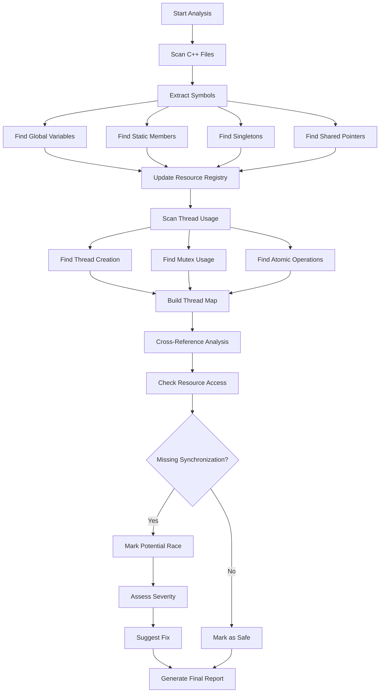

# Detection Process Flow

```mermaid
flowchart TD
    START[Start Analysis] --> SCAN[Scan C++ Files]
    SCAN --> EXTRACT[Extract Symbols]
    
    EXTRACT --> GLOBAL[Find Global Variables]
    EXTRACT --> STATIC[Find Static Members]
    EXTRACT --> SINGLETON[Find Singletons]
    EXTRACT --> SHARED_PTR[Find Shared Pointers]
    
    GLOBAL --> REGISTRY[Update Resource Registry]
    STATIC --> REGISTRY
    SINGLETON --> REGISTRY
    SHARED_PTR --> REGISTRY
    
    REGISTRY --> THREAD_SCAN[Scan Thread Usage]
    THREAD_SCAN --> FIND_THREADS[Find Thread Creation]
    THREAD_SCAN --> FIND_MUTEX[Find Mutex Usage]
    THREAD_SCAN --> FIND_ATOMIC[Find Atomic Operations]
    
    FIND_THREADS --> THREAD_MAP[Build Thread Map]
    FIND_MUTEX --> THREAD_MAP
    FIND_ATOMIC --> THREAD_MAP
    
    THREAD_MAP --> CROSS_REF[Cross-Reference Analysis]
    CROSS_REF --> CHECK_ACCESS[Check Resource Access]
    CHECK_ACCESS --> MISSING_SYNC{Missing Synchronization?}
    
    MISSING_SYNC -->|Yes| POTENTIAL_RACE[Mark Potential Race]
    MISSING_SYNC -->|No| SAFE[Mark as Safe]
    
    POTENTIAL_RACE --> SEVERITY[Assess Severity]
    SEVERITY --> SUGGEST[Suggest Fix]
    
    SUGGEST --> FINAL_REPORT[Generate Final Report]
    SAFE --> FINAL_REPORT
```
