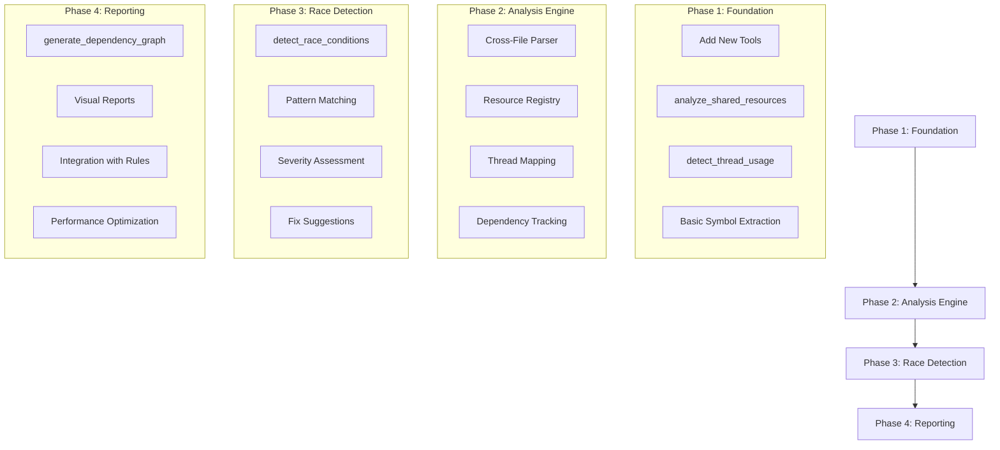

# Implementation Phases

```mermaid
flowchart TD
    PHASE1[Phase 1: Foundation] --> PHASE2[Phase 2: Analysis Engine]
    PHASE2 --> PHASE3[Phase 3: Race Detection]  
    PHASE3 --> PHASE4[Phase 4: Reporting]
    
    subgraph P1 [Phase 1: Foundation]
        P1_1[Add New Tools]
        P1_2[analyze_shared_resources]
        P1_3[detect_thread_usage]
        P1_4[Basic Symbol Extraction]
    end
    
    subgraph P2 [Phase 2: Analysis Engine]
        P2_1[Cross-File Parser]
        P2_2[Resource Registry]
        P2_3[Thread Mapping]
        P2_4[Dependency Tracking]
    end
    
    subgraph P3 [Phase 3: Race Detection]
        P3_1[detect_race_conditions]
        P3_2[Pattern Matching]
        P3_3[Severity Assessment]
        P3_4[Fix Suggestions]
    end
    
    subgraph P4 [Phase 4: Reporting]
        P4_1[generate_dependency_graph]
        P4_2[Visual Reports]
        P4_3[Integration with Rules]
        P4_4[Performance Optimization]
    end
```
