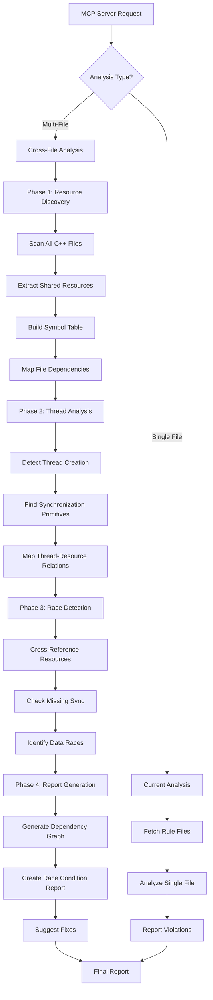

# Main Workflow - Race Condition Detection

```mermaid
flowchart TD
    A[MCP Server Request] --> B{Analysis Type?}
    
    B -->|Single File| C[Current Analysis]
    C --> C1[Fetch Rule Files]
    C1 --> C2[Analyze Single File]
    C2 --> C3[Report Violations]
    
    B -->|Multi-File| D[Cross-File Analysis]
    
    D --> E[Phase 1: Resource Discovery]
    E --> E1[Scan All C++ Files]
    E1 --> E2[Extract Shared Resources]
    E2 --> E3[Build Symbol Table]
    E3 --> E4[Map File Dependencies]
    
    E4 --> F[Phase 2: Thread Analysis]
    F --> F1[Detect Thread Creation]
    F1 --> F2[Find Synchronization Primitives]
    F2 --> F3[Map Thread-Resource Relations]
    
    F3 --> G[Phase 3: Race Detection]
    G --> G1[Cross-Reference Resources]
    G1 --> G2[Check Missing Sync]
    G2 --> G3[Identify Data Races]
    
    G3 --> H[Phase 4: Report Generation]
    H --> H1[Generate Dependency Graph]
    H1 --> H2[Create Race Condition Report]
    H2 --> H3[Suggest Fixes]
    
    H3 --> I[Final Report]
    C3 --> I
```

