# CodeGuard Analysis Workflow

## Overview
This document describes the comprehensive workflow for C++ code analysis using CodeGuard with static analysis tools and Copilot/MCP integration.

## Main Workflow Diagram

```mermaid
graph TD
    A[📁 C++ Source Files<br/>.cpp, .h, .hpp] --> B[🔧 Static Analysis Tools<br/>Clang, Cppcheck, etc.]
    A --> C[🤖 Copilot/MCP Analysis<br/>AI-powered code review]
    
    B --> D[📋 Potential Issues List<br/>Combined results]
    C --> D
    
    D --> E[👨‍💻 Manual Code Review<br/>Developer validation]
    E --> F[🧪 Dynamic Testing<br/>Runtime verification]
    F --> G[📊 Final Report<br/>HTML + Markdown output]
    
    style A fill:#e3f2fd
    style B fill:#fff3e0
    style C fill:#e8f5e8
    style D fill:#fce4ec
    style E fill:#f3e5f5
    style F fill:#e0f2f1
    style G fill:#e1f5fe
```



## Detailed Analysis Flow

```mermaid
graph TD
    A1[🎯 Start Analysis] --> A2{File Type Check}
    A2 -->|C++ Files| A3[📖 Read File Content]
    A2 -->|Other| A4[❌ Show Error Message]
    
    A3 --> B1[🔧 Static Analysis Phase]
    A3 --> C1[🤖 AI Analysis Phase]
    
    B1 --> B2[Clang Static Analyzer]
    B1 --> B3[Cppcheck Scan]
    B1 --> B4[Custom Rules Check]
    
    C1 --> C2[Load Rule Guidelines<br/>LGEDV/MISRA/CERT]
    C2 --> C3[Create Focused Prompt]
    C3 --> C4[Send to Copilot API]
    C4 --> C5[Stream Results]
    
    B2 --> D1[📊 Merge Results]
    B3 --> D1
    B4 --> D1
    C5 --> D1
    
    D1 --> E1[📋 Generate Report]
    E1 --> E2[💾 Save HTML Report]
    E1 --> E3[💾 Save Markdown Report]
    E1 --> E4[📺 Display in Output Channel]
    
    style A1 fill:#e1f5fe
    style D1 fill:#fff8e1
    style E1 fill:#e8f5e8
```



## Rule Analysis Types

```mermaid
graph LR
    A[🎯 Rule Analysis] --> B[LGEDV Rules]
    A --> C[MISRA C++ 2008]
    A --> D[CERT C++]
    A --> E[RapidScan]
    A --> F[Critical Rules]
    
    B --> G[📋 LGEDVRuleGuide.md]
    C --> H[📋 Misracpp2008Guidelines.md]
    D --> I[📋 CertcppGuidelines.md]
    E --> J[📋 RapidScanGuidelines.md]
    F --> K[📋 StaticGuidelines_High.md]
    
    G --> L[🤖 AI Analysis]
    H --> L
    I --> L
    J --> L
    K --> L
    
    L --> M[📊 Formatted Output]
    
    style A fill:#e3f2fd
    style L fill:#e8f5e8
    style M fill:#fff3e0
```



## Extension Architecture

```mermaid
graph TD
    A[👨‍💻 User Action<br/>Click "Check Rules"] --> B[📝 extension.ts<br/>Command Registration]
    
    B --> C{🔍 Validate Editor}
    C -->|Valid C++| D[📖 Read File Content]
    C -->|Invalid| E[❌ Error Message]
    
    D --> F[🤖 Connect to Copilot API<br/>vscode.lm.selectChatModels]
    F --> G[📋 Load Rule Files<br/>*.md guidelines]
    G --> H[🔧 Create Focused Prompt<br/>Code + Rules + Format]
    
    H --> I[📤 Send Request to AI<br/>model.sendRequest]
    I --> J[📥 Stream Response<br/>Real-time results]
    
    J --> K[📺 Display in Output Channel]
    J --> L[💾 Save HTML Report]
    J --> M[💾 Save Markdown Report]
    
    style A fill:#e3f2fd
    style F fill:#e8f5e8
    style I fill:#fff3e0
    style J fill:#fce4ec
```

## Installation & Setup Flow

```mermaid
graph TD
    A[🚀 Installation Start] --> B[📦 Install Dependencies<br/>ninja-build, cmake, clang, etc.]
    B --> C[📊 Install Node.js Tools<br/>npm, vsce, typescript]
    C --> D[🔧 Build Extension<br/>npm run compile]
    D --> E[📦 Package Extension<br/>vsce package]
    E --> F[🔌 Install in VS Code<br/>code --install-extension]
    F --> G[🔄 Reload VS Code]
    G --> H[✅ Ready to Use]
    
    style A fill:#e1f5fe
    style H fill:#e8f5e8
```



## Features

### ✅ Current Capabilities
- **Multi-Rule Support**: LGEDV, MISRA, CERT, RapidScan, Critical
- **AI-Powered Analysis**: Integration with GitHub Copilot
- **Static Analysis**: Clang, Cppcheck integration
- **Report Generation**: HTML and Markdown outputs
- **Real-time Feedback**: Streaming results in output channel

### 🔄 Development Flow
1. **Code Analysis**: Automatic detection of C++ files
2. **Rule Application**: Apply selected rule sets
3. **AI Processing**: Send to Copilot for intelligent analysis
4. **Result Aggregation**: Combine static and AI analysis
5. **Report Generation**: Create comprehensive reports
6. **Developer Review**: Manual validation and fixes

### 📊 Output Formats
- **Output Channel**: Real-time streaming results
- **HTML Report**: Rich formatted analysis with styling
- **Markdown Report**: Developer-friendly documentation

## Usage Commands

```bash
# Start analysis server
python3 optimized_viewer.py

# Build extension
npm run compile
vsce package

# Install extension
code --install-extension lgedv-codeguard-1.0.0.vsix

# Check port usage
sudo netstat -tulpn | grep :8080
```

---

*Workflow Documentation v1.0*  
*CodeGuard Extension for VS Code*
