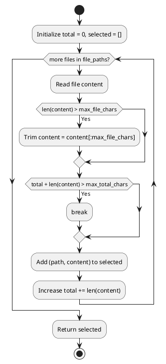

# current implementation
Dưới đây là các giới hạn số file C++ thực tế được gửi lên Copilot (tức là số file được nhúng vào prompt code context) cho từng trường hợp:

---

**1. Memory Leak (check_leaks):**
- Hàm: `_create_code_context_section`
- Giới hạn:
  ```python
  max_files = 3  # Max files to include (reduced from 5)
  ```
- Chỉ lấy tối đa 3 file C++ ưu tiên nhất (có nhiều leak nhất) để nhúng vào prompt.

---

**2. Race Condition (check_races):**
- Hàm: `_create_race_code_context_section`
- Giới hạn:
  ```python
  max_files = 3  # Limit for token efficiency
  ```
- Chỉ lấy tối đa 3 file ưu tiên (có race condition hoặc thread usage) để nhúng vào prompt.

---

**3. Resource Leak (check_resources):**
- Hàm: `_create_resource_code_context_section`
- Giới hạn:
  ```python
  for i, file_path in enumerate(list(analyzed_files)[:3], 1):
      # ...existing code...
  ```
- Chỉ lấy tối đa 3 file liên quan đến resource leak để nhúng vào prompt.

---

**Tóm lại:**  
Cả 3 trường hợp đều chỉ gửi tối đa 3 file C++ thực tế lên Copilot trong phần code context của prompt.


# Todo
# Hướng dẫn chọn file C++ đưa vào prompt AI theo giới hạn token GPT-4

## 1. Mục tiêu
- Đảm bảo tổng số token (ký tự) gửi lên GPT-4 không vượt quá giới hạn (ví dụ: 100,000 ký tự ~ 25,000 tokens).
- Ưu tiên các file quan trọng, file có nhiều findings hoặc severity cao.
- Tự động cắt bớt file quá dài, chỉ lấy phần đầu mỗi file nếu cần.

## 2. Thuật toán chọn file

### Bước 1: Đếm số ký tự từng file
- Dùng `os.path.getsize(path)` để lấy số byte (gần đúng số ký tự với file UTF-8).
- Hoặc đọc file và dùng `len(content)` để lấy số ký tự thực tế.

### Bước 2: Sắp xếp file theo mức độ ưu tiên
- Có thể sort theo số findings, độ lớn, hoặc tên file.

### Bước 3: Chọn file cho đến khi đạt ngưỡng
```python
def select_cpp_files_for_prompt(file_paths, max_total_chars=100000, max_file_chars=20000):
    selected = []
    total = 0
    for path in file_paths:
        with open(path, 'r', encoding='utf-8') as f:
            content = f.read()
        # Cắt nếu file quá dài
        if len(content) > max_file_chars:
            content = content[:max_file_chars]
        if total + len(content) > max_total_chars:
            break
        selected.append((path, content))
        total += len(content)
    return selected
```
- `max_total_chars`: tổng số ký tự cho toàn bộ files (ví dụ 100,000).
- `max_file_chars`: số ký tự tối đa cho mỗi file (ví dụ 20,000).

### Bước 4: Đưa nội dung các file đã chọn vào prompt gửi cho Copilot/AI.

## 3. Lưu ý
- Nếu file quá lớn, chỉ lấy phần đầu (hoặc đoạn code liên quan findings).
- Có thể cộng thêm phần metadata, findings, hướng dẫn vào tổng số ký tự dự kiến.
- Nên để dư 10-20% so với giới hạn token thực tế để tránh lỗi.

---

# Lược đồ PlantUML thuật toán chọn file



## 
Hiện tại, với Copilot GPT-4 (OpenAI GPT-4-turbo), giới hạn token cho mỗi prompt thường là **128k tokens** (tức khoảng 400,000 ký tự tiếng Anh, nhưng thực tế nên để an toàn ở mức thấp hơn, ví dụ 80k–100k tokens, tức 300,000 ký tự trở xuống). Tuy nhiên, nhiều hệ thống vẫn mặc định an toàn ở mức **8k–32k tokens** (tức 32,000–128,000 ký tự).

### Thuật toán chọn file C++ dựa trên số bytes/ký tự

**Mục tiêu:**  
Chọn nhiều file nhất có thể, tổng số bytes/ký tự không vượt quá ngưỡng an toàn (ví dụ 100,000 ký tự).

#### Bước 1: Đếm số bytes/ký tự từng file
- Dùng `os.path.getsize(path)` để lấy số byte (nếu file là ASCII/UTF-8, số byte ≈ số ký tự).
- Nếu cần chính xác số ký tự (với UTF-8), dùng `len(open(path, encoding="utf-8").read())`.

#### Bước 2: Sắp xếp file theo mức độ ưu tiên (ví dụ: file có nhiều leak nhất, hoặc theo tên)
- Có thể sort theo độ lớn, hoặc theo mức độ nghiêm trọng của findings.

#### Bước 3: Chọn file cho đến khi đạt ngưỡng
```python
def select_cpp_files_for_prompt(file_paths, max_total_chars=100000, max_file_chars=20000):
    selected = []
    total = 0
    for path in file_paths:
        with open(path, 'r', encoding='utf-8') as f:
            content = f.read()
        # Cắt nếu file quá dài
        if len(content) > max_file_chars:
            content = content[:max_file_chars]
        if total + len(content) > max_total_chars:
            break
        selected.append((path, content))
        total += len(content)
    return selected
```
- `max_total_chars`: tổng số ký tự cho toàn bộ files (ví dụ 100,000).
- `max_file_chars`: số ký tự tối đa cho mỗi file (ví dụ 20,000).

#### Bước 4: Đưa nội dung các file đã chọn vào prompt gửi cho Copilot/AI.

---

**Tóm lại:**  
- GPT-4-turbo hỗ trợ tối đa 128k tokens (~400,000 ký tự), nhưng nên để an toàn ở mức 80k–100k tokens.
- Đếm số bytes/ký tự từng file, cộng dồn, dừng khi gần chạm ngưỡng.
- Ưu tiên file quan trọng, cắt bớt file quá dài.
- Đảm bảo tổng số ký tự không vượt ngưỡng token của model.

Bạn có thể áp dụng thuật toán trên để tự động chọn file C++ phù hợp cho prompt AI mà không lo vượt giới hạn token.