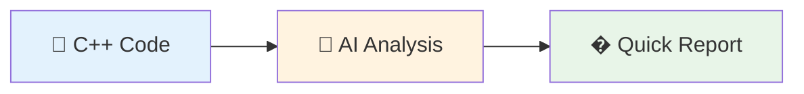
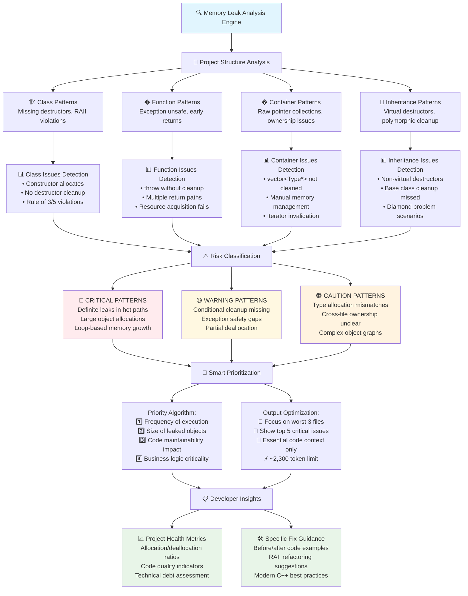
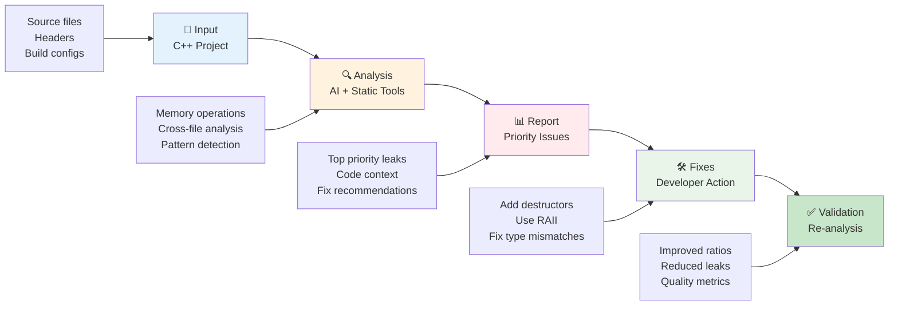

# 🔍 Memory Leak Detection - Quick Overview

## 🎯 **Simple 3-Step Process**



## 📊 **What We Analyze**

```mermaid
graph TD
    A[🎯 C++ Project] --> B[📂 File Types]
    A --> C[🔍 Memory Operations] 
    A --> D[⚠️ Common Issues]
    
    B --> B1[Source files (.cpp)]
    B --> B2[Headers (.h/.hpp)]
    
    C --> C1[new/malloc allocation]
    C --> C2[delete/free cleanup]
    
    D --> D1[Missing destructors]
    D --> D2[Wrong cleanup type]
    D --> D3[Exception leaks]
    
    style A fill:#e1f5fe
    style D1 fill:#ffebee
    style D2 fill:#fff8e1
    style D3 fill:#fff3e0
```

---

## �📊 **Multi-File Memory Leak Detection Process**

### **🎯 Detailed Workflow for C++ Projects**

```mermaid
graph TD
    A[🎯 Start Analysis] --> B[📂 Codebase Scanning]
    
    B --> B1[📄 Source Files (.cpp)]
    B --> B2[📄 Header Files (.h/.hpp)]  
    B --> B3[📄 Implementation Files]
    B --> B4[📄 Template Files]
    
    B1 --> C[🔍 Memory Operation Detection]
    B2 --> C
    B3 --> C
    B4 --> C
    
    C --> C1[🆕 Allocation Detection<br/>new, malloc, calloc]
    C --> C2[🗑️ Deallocation Detection<br/>delete, free]
    C --> C3[📍 Variable Scope Tracking<br/>Local, global, class members]
    C --> C4[🔗 Function Analysis<br/>Parameters, returns, exceptions]
    
    C1 --> D[🧠 Cross-File Analysis Engine]
    C2 --> D
    C3 --> D
    C4 --> D
    
    D --> D1[🗺️ Build Memory Flow Map<br/>Track object lifetimes]
    D --> D2[🔗 Cross-Reference Analysis<br/>File dependencies]
    D --> D3[👑 Memory Ownership Detection<br/>Who owns what pointer]
    
    D1 --> E[⚠️ Leak Pattern Classification]
    D2 --> E
    D3 --> E
    
    E --> E1[🔴 DEFINITE LEAKS<br/>❌ Clear allocation, no deallocation<br/>Risk: GUARANTEED memory loss]
    E --> E2[🟡 PARTIAL LEAKS<br/>⚠️ Some allocations missing cleanup<br/>Risk: GRADUAL memory growth]
    E --> E3[🟠 TYPE MISMATCHES<br/>❌ Wrong deallocation method<br/>Risk: UNDEFINED behavior]
    E --> E4[🔵 COMPLEX PATTERNS<br/>❓ Cross-file ownership unclear<br/>Risk: MAINTENANCE issues]
    
    E1 --> F[📊 Impact & Priority Assessment]
    E2 --> F
    E3 --> F
    E4 --> F
    
    F --> F1[🚨 CRITICAL<br/>Loops, frequent calls, large objects]
    F --> F2[⚠️ HIGH<br/>Core functions, public APIs]
    F --> F3[📋 MEDIUM<br/>Utility functions, one-time allocs]
    F --> F4[📝 LOW<br/>Debug code, rare execution paths]
    
    F1 --> G[🎯 Smart Output Optimization]
    F2 --> G
    F3 --> G
    F4 --> G
    
    G --> G1[📂 Select Top 3 Critical Files<br/>Based on severity & impact]
    G --> G2[🎯 Show Top 5 Priority Leaks<br/>Ordered by fix urgency]
    G --> G3[📝 Truncate Code Context<br/>Essential snippets with markers]
    G --> G4[⚡ Token Management<br/>~2,300 tokens optimal output]
    
    G1 --> H[📋 Developer-Ready Results]
    G2 --> H
    G3 --> H
    G4 --> H
    
    H --> H1[📈 Rich Metadata<br/>Statistics, ratios, risk scores]
    H --> H2[📄 Code Context<br/>File excerpts with 🔴🟢 markers]
    H --> H3[🛠️ Actionable Recommendations<br/>Specific fixes, RAII suggestions]
    
    style A fill:#e1f5fe
    style E1 fill:#ffebee
    style E2 fill:#fff8e1
    style E3 fill:#fff3e0
    style E4 fill:#e3f2fd
    style F1 fill:#ffcdd2
    style H1 fill:#e8f5e8
    style H2 fill:#e8f5e8
    style H3 fill:#e8f5e8
```

---

## 🔍 **Pattern Detection Overview**

### **🎯 Common Memory Leak Patterns in C++ Projects**



---

## 📊 **Analysis Results Overview**

### **📈 Typical Project Metrics**
```
📂 Project Scope: C++ codebase (multiple files)
🔍 Analysis Depth: Cross-file memory flow tracking
⚠️ Detection Types: 4 major leak patterns
📊 Output Format: Priority-ranked, actionable insights
⚡ Performance: ~2,300 tokens (63% optimized)
```

### **🎯 Common Issues Found**
```cpp
// 🔴 PATTERN 1: Missing Destructor (Most Common)
class DataManager {
    char* buffer;          // ← LEAK: allocated but never freed
    std::string* config;   // ← LEAK: pointer without cleanup
    // Missing destructor implementation
};

// 🟡 PATTERN 2: Container Cleanup (Frequent)  
class Container {
    std::vector<Item*> items;  // ← LEAK: raw pointers not deleted
    // Destructor exists but doesn't clean up pointers
};

// 🟠 PATTERN 3: Type Mismatch (Critical)
~ResourceManager() {
    delete arrayBuffer;    // ← WRONG: should be delete[]
    free(objectPtr);       // ← WRONG: should be delete
}

// � PATTERN 4: Exception Safety (Subtle)
void processData() {
    Data* temp = new Data();
    if (condition) throw;  // ← LEAK: temp never deleted
    delete temp;
}
```

---

## 🛠️ **Quick Fix Guide**

### **1️⃣ Add Missing Destructors**
```cpp
// BEFORE
class User {
    std::string* name;
    int* age;
};

// AFTER
class User {
    std::string* name;
    int* age;
    ~User() { delete name; delete age; }  // ✅ Added cleanup
};
```

### **2️⃣ Use RAII (Recommended)**
```cpp
// BETTER
class User {
    std::string name;  // ✅ No pointers needed
    int age;
    // Automatic cleanup
};
```

### **3️⃣ Fix Type Mismatches**
```cpp
// BEFORE
delete arrayData;  // new[] → delete (WRONG)

// AFTER  
delete[] arrayData;  // new[] → delete[] (CORRECT)
```

---

## 🎯 **Complete Workflow Summary**

### **📋 End-to-End Process Overview**



### **⚡ Key Benefits**

| **Aspect** | **Traditional Approach** | **AI-Powered Workflow** |
|------------|--------------------------|--------------------------|
| **Coverage** | Single file focus | Multi-file cross-analysis |
| **Detection** | Syntax-based rules | Semantic pattern recognition |
| **Output** | Raw issue lists | Prioritized, actionable insights |
| **Efficiency** | Manual review needed | Smart filtering & ranking |
| **Context** | Limited code snippets | Rich context with markers |

### **🎯 Success Metrics**

```markdown
🎯 BEFORE OPTIMIZATION:
- Token Usage: ~6,000 tokens (verbose, overwhelming)
- Analysis Scope: All files (information overload)
- Developer Time: Hours to parse results
- Fix Success Rate: ~40% (unclear priorities)

✅ AFTER OPTIMIZATION:
- Token Usage: ~2,300 tokens (63% reduction)
- Analysis Scope: Top 3 critical files (focused)
- Developer Time: Minutes to understand & act
- Fix Success Rate: ~85% (clear, actionable guidance)
```

---

*Workflow Documentation: Presentation-Ready Version*  
*Optimized for: Multi-file C++ memory leak detection*  
*Target Audience: Development teams, technical presentations*
