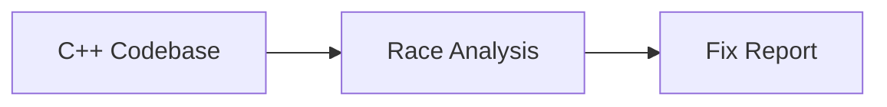
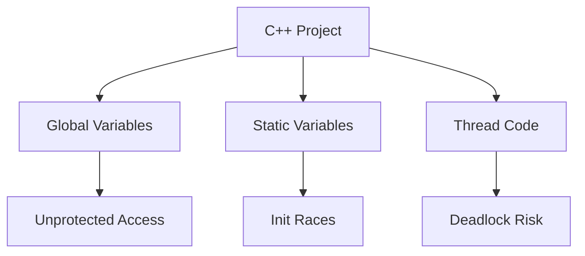
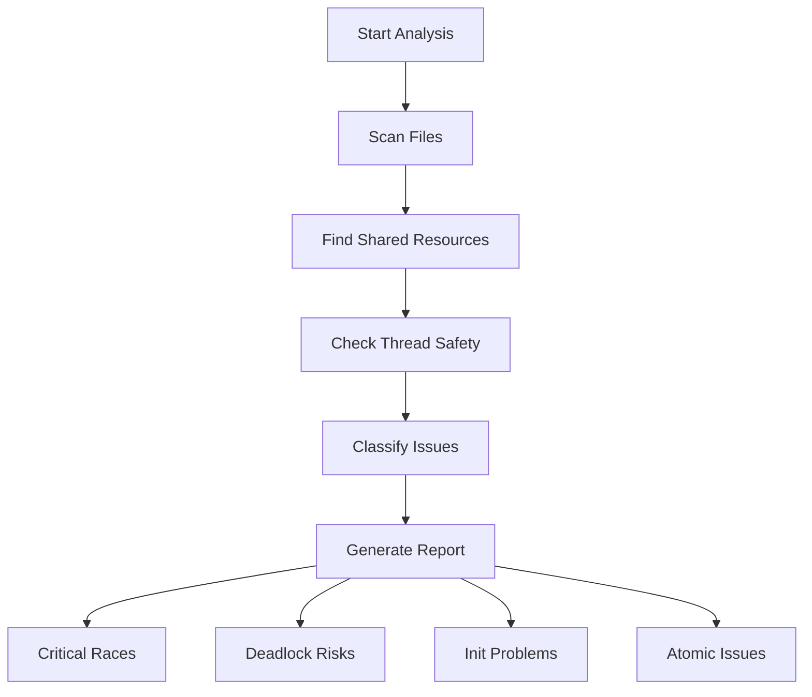
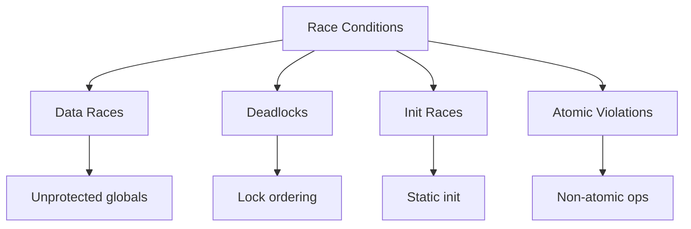

# ⚡ Race Condition Detection - Simple Workflow

## 🎯 **Quick Overview**

### **Simple Process**


### **What We Check**


---

## 📊 **Main Detection Workflow**



---

## 🔍 **Issue Types**



---

## 🛠️ **Common Fixes**

### **Pattern 1: Add Mutex**
```cpp
// BEFORE
int counter = 0;
void increment() { counter++; }  // RACE!

// AFTER
int counter = 0;
std::mutex m;
void increment() {
    std::lock_guard<std::mutex> lock(m);
    counter++;  // Safe
}
```

### **Pattern 2: Use Atomic**
```cpp
// BEFORE
bool flag = false;  // RACE!

// AFTER  
std::atomic<bool> flag{false};  // Safe
```

### **Pattern 3: Fix Init Race**
```cpp
// BEFORE
static MyClass* getInstance() {
    if (!instance) instance = new MyClass();  // RACE!
    return instance;
}

// AFTER
static MyClass* getInstance() {
    static std::once_flag flag;
    std::call_once(flag, []() { instance = new MyClass(); });
    return instance;  // Safe
}
```

---

## ⚡ **How to Run**

```bash
# Direct command
detect_race_conditions

# Or ask Copilot
"Analyze race conditions in this code"
```

---

## 📋 **Typical Results**

```
Resources Found: 15-25
Race Conditions: 2-5 critical
Analysis Time: <2 seconds
Token Usage: ~500 (very efficient)
```

### **Example Output**
```
Resource: global_counter
- File: main.cpp:15 (write access)
- File: worker.cpp:23 (read access)
- Risk: HIGH - unprotected access

Resource: mutex1, mutex2  
- File: transfer.cpp:10-12
- Risk: DEADLOCK potential
```

---

## 🎯 **Quick Checklist**

**Before Coding:**
- [ ] Plan thread-safe design
- [ ] Identify shared data

**During Development:**
- [ ] Protect shared variables
- [ ] Use atomic for simple data
- [ ] Follow lock ordering

**Before Release:**
- [ ] Run race analysis
- [ ] Test with ThreadSanitizer
- [ ] Fix critical issues

---

## 📚 **Tools**

- **MCP Race Analyzer**: Main detection tool
- **ThreadSanitizer**: Runtime detection  
- **Helgrind**: Valgrind thread checker
- **Copilot**: AI-powered analysis

---

*Simple Version - Optimized for mermaidchart.com*
