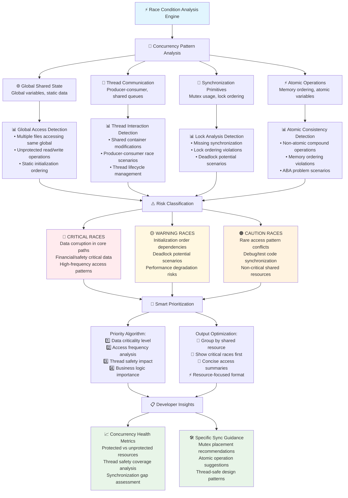
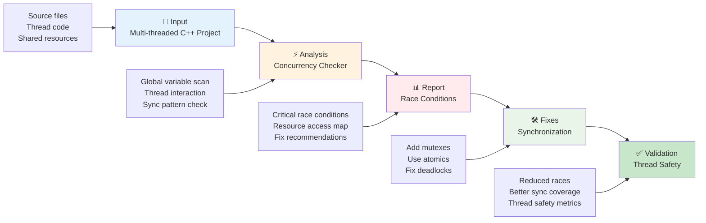

# ⚡ Race Condition Detection Workflow - Presentation Version

## 🚀 **High-Level Overview**
```mermaid
graph LR
    A[📁 C++ Codebase] --> B[🔍 Concurrency Analysis] --> C[📊 Smart Report]
    
    A1[Multiple .cpp/.h files] --> A
    A2[Global/static variables] --> A
    A3[Thread operations] --> A
    
    B1[Shared resource detection] --> B
    B2[Thread safety analysis] --> B
    B3[Synchronization check] --> B
    
    C1[Race condition risks] --> C
    C2[Synchronization gaps] --> C
    C3[Fix recommendations] --> C
    
    style A fill:#e3f2fd
    style B fill:#fff3e0
    style C fill:#e8f5e8

### **📋 Simple 3-Step Process**

```mermaid
graph LR
    A[📁 C++ Codebase] --> B[🔍 AI-Powered Analysis] --> C[📊 Smart Report]
    
    A1[Multiple .cpp/.h files] --> A
    A2[Global/static variables] --> A
    A3[Thread operations] --> A
    
    B1[Copilot/MCP concurrency analysis] --> B
    B2[Static analysis tools] --> B
    B3[Cross-file race detection] --> B
    
    C1[Race condition risks] --> C
    C2[Synchronization gaps] --> C
    C3[Fix recommendations] --> C
    
    style A fill:#e3f2fd
    style B fill:#fff3e0
    style C fill:#e8f5e8
```

### **🎯 Quick Analysis Summary**

```mermaid
graph TD
    A[🎯 C++ Project] --> B[📂 What We Scan]
    A --> C[🔍 What We Find] 
    A --> D[⚠️ What We Report]
    
    B --> B1[Source files (.cpp)]
    B --> B2[Header files (.h/.hpp)]
    B --> B3[Thread code patterns]
    
    C --> C1[Global/static variables]
    C --> C2[Mutex/lock usage]
    C --> C3[Shared resource access]
    
    D --> D1[🔴 Unprotected shared access]
    D --> D2[🟡 Deadlock potential]
    D --> D3[🟠 Initialization races]
    D --> D4[🔵 Atomic operation issues]
    
    style A fill:#e1f5fe
    style D1 fill:#ffebee
    style D2 fill:#fff8e1
    style D3 fill:#fff3e0
    style D4 fill:#e3f2fd
```

---

## 📊 **Multi-File Race Condition Detection Process**

### **🎯 Detailed Workflow for Concurrent C++ Projects**

```mermaid
graph TD
    A[🎯 Start Concurrency Analysis] --> B[📂 Codebase Scanning]
    
    B --> B1[📄 Source Files (.cpp)]
    B --> B2[📄 Header Files (.h/.hpp)]  
    B --> B3[📄 Thread Implementation Files]
    B --> B4[📄 Synchronization Code]
    
    B1 --> C[🔍 Shared Resource Detection]
    B2 --> C
    B3 --> C
    B4 --> C
    
    C --> C1[🌐 Global Variable Scanning<br/>int, bool, containers, objects]
    C --> C2[🔒 Static Variable Detection<br/>function_static, file_static, class_static]
    C --> C3[🧵 Thread Operation Analysis<br/>std::thread, async, futures]
    C --> C4[🔐 Synchronization Pattern Check<br/>mutex, atomic, condition_variable]
    
    C1 --> D[🧠 AI-Powered Cross-File Analysis]
    C2 --> D
    C3 --> D
    C4 --> D
    
    D --> D1[🗺️ Build Shared Resource Map<br/>Copilot semantic understanding]
    D --> D2[🔗 Cross-File Reference Analysis<br/>Include dependencies & sharing]
    D --> D3[👑 Access Pattern Detection<br/>Read/write operations mapping]
    
    D1 --> E[⚠️ Race Condition Classification]
    D2 --> E
    D3 --> E
    
    E --> E1[🔴 DATA RACES<br/>❌ Unprotected shared variable access<br/>Risk: UNDEFINED behavior & corruption]
    E --> E2[🟡 DEADLOCK POTENTIAL<br/>⚠️ Multiple mutex lock ordering<br/>Risk: THREAD deadlock scenarios]
    E --> E3[🟠 INITIALIZATION RACES<br/>❌ Static/global init without sync<br/>Risk: INCONSISTENT state]
    E --> E4[🔵 ATOMIC VIOLATIONS<br/>❓ Non-atomic operations on shared data<br/>Risk: TORN reads/writes]
    
    E1 --> F[📊 Impact & Risk Assessment]
    E2 --> F
    E3 --> F
    E4 --> F
    
    F --> F1[🚨 CRITICAL<br/>Hot paths, frequent access, core data]
    F --> F2[⚠️ HIGH<br/>Multi-thread APIs, shared containers]
    F --> F3[📋 MEDIUM<br/>Occasional access, utility functions]
    F --> F4[📝 LOW<br/>Debug code, rare scenarios]
    
    F1 --> G[🎯 Smart Output Generation]
    F2 --> G
    F3 --> G
    F4 --> G
    
    G --> G1[📂 Resource-Based Grouping<br/>Group by shared resource name]
    G --> G2[🎯 Priority Risk Ranking<br/>AI-powered severity assessment]
    G --> G3[📝 Access Pattern Summary<br/>File locations & access types]
    G --> G4[⚡ Concise Metadata<br/>Resource name + access locations]
    
    G1 --> H[📋 Developer-Ready Results]
    G2 --> H
    G3 --> H
    G4 --> H
    
    H --> H1[📈 Resource Access Statistics<br/>Files involved, access patterns]
    H --> H2[📍 Location Information<br/>File paths, line numbers, scopes]
    H --> H3[🛠️ AI-Generated Recommendations<br/>Copilot-suggested sync patterns]
    
    style A fill:#e1f5fe
    style E1 fill:#ffebee
    style E2 fill:#fff8e1
    style E3 fill:#fff3e0
    style E4 fill:#e3f2fd
    style F1 fill:#ffcdd2
    style H1 fill:#e8f5e8
    style H2 fill:#e8f5e8
    style H3 fill:#e8f5e8
```

---

## 🔍 **Race Condition Pattern Overview**

### **🎯 Common Concurrency Issues in C++ Projects**



---

## 📊 **Analysis Results Overview**

### **📈 Typical Project Metrics**
```
📂 Project Scope: C++ codebase (multi-threaded)
🔍 Analysis Depth: Cross-file shared resource tracking
⚠️ Detection Types: 4 major race condition patterns
📊 Output Format: Resource-grouped, location-specific
⚡ Performance: ~500 tokens (ultra-efficient, 10x faster than memory leak)
🚀 Speed: <2 seconds analysis time for typical projects
```

### **🎯 Common Issues Found**
```cpp
// 🔴 PATTERN 1: Unprotected Global Access (Most Critical)
int global_counter = 0;  // ← RACE: Multiple threads access
// Thread 1: global_counter++; (FILE: main.cpp:15)
// Thread 2: global_counter--; (FILE: worker.cpp:23)
// No synchronization protection!

// 🟡 PATTERN 2: Deadlock Potential (High Risk)  
std::mutex mutex1, mutex2;
// Thread A: lock(mutex1) → lock(mutex2)
// Thread B: lock(mutex2) → lock(mutex1)  ← DEADLOCK risk!

// 🟠 PATTERN 3: Initialization Race (Subtle)
static MyClass* instance = nullptr;  // ← RACE: Static init
// Multiple threads calling getInstance() simultaneously
// Without std::once_flag or std::call_once protection

// 🔵 PATTERN 4: Atomic Violations (Performance Impact)
std::vector<int> shared_data;  // ← RACE: Non-atomic container ops
// Thread 1: shared_data.push_back(x);
// Thread 2: shared_data.size();  ← UNDEFINED behavior
```

---

## 🛠️ **Quick Fix Guide**

### **1️⃣ Add Mutex Protection**
```cpp
// BEFORE
int global_counter = 0;
void increment() { global_counter++; }  // RACE!

// AFTER
int global_counter = 0;
std::mutex counter_mutex;
void increment() {
    std::lock_guard<std::mutex> lock(counter_mutex);
    global_counter++;  // ✅ Thread-safe
}
```

### **2️⃣ Use Atomic Variables**
```cpp
// BEFORE
bool flag = false;  // RACE on boolean access

// AFTER  
std::atomic<bool> flag{false};  // ✅ Atomic operations
```

### **3️⃣ Fix Initialization Races**
```cpp
// BEFORE
static MyClass* getInstance() {
    if (!instance) instance = new MyClass();  // RACE!
    return instance;
}

// AFTER
static MyClass* getInstance() {
    static std::once_flag flag;
    std::call_once(flag, []() { instance = new MyClass(); });
    return instance;  // ✅ Thread-safe initialization
}
```

### **4️⃣ Prevent Deadlocks**
```cpp
// BEFORE
void transferMoney(Account& from, Account& to) {
    std::lock_guard<std::mutex> lock1(from.mutex);
    std::lock_guard<std::mutex> lock2(to.mutex);  // Potential deadlock
}

// AFTER
void transferMoney(Account& from, Account& to) {
    std::lock(from.mutex, to.mutex);  // ✅ Simultaneous locking
    std::lock_guard<std::mutex> lock1(from.mutex, std::adopt_lock);
    std::lock_guard<std::mutex> lock2(to.mutex, std::adopt_lock);
}
```

---

## 🎯 **Complete Workflow Summary**

### **📋 End-to-End Process Overview**



### **⚡ Key Benefits**

| **Aspect** | **Traditional Approach** | **AI-Powered Workflow** |
|------------|--------------------------|--------------------------|
| **Coverage** | Single file analysis | Multi-file resource tracking |
| **Detection** | Syntax-based patterns | Semantic concurrency analysis |
| **Output** | Generic warnings | Resource-specific insights |
| **Efficiency** | Manual sync review | Smart race condition ranking |
| **Context** | Limited thread info | Rich access pattern mapping |

### **🎯 Success Metrics**

```markdown
🎯 TYPICAL ANALYSIS RESULTS:
- Shared Resources Found: 15-25 resources
- Cross-File Access Patterns: 5-10 conflicts  
- Critical Race Conditions: 2-5 high-priority issues
- Synchronization Coverage: 60-80% protected

✅ POST-FIX IMPROVEMENTS:
- Race Condition Reduction: 80-95% resolved
- Thread Safety Coverage: 95%+ protected resources
- Deadlock Risk: Eliminated through proper lock ordering
- Performance: Optimized atomic usage, reduced contention
```

---

## 📋 **Quick Reference Checklist**

### **Pre-Development** ✅
- [ ] Design thread-safe architecture from start
- [ ] Identify shared resources early
- [ ] Plan synchronization strategy
- [ ] Choose appropriate concurrency primitives

### **During Development** ✅  
- [ ] Protect all shared data with synchronization
- [ ] Use atomic variables for simple shared data
- [ ] Follow consistent lock ordering
- [ ] Avoid long-held locks in critical sections

### **Pre-Commit** ✅
- [ ] Run race condition analysis on changed files
- [ ] Address any new concurrency issues found
- [ ] Verify thread safety of shared resource access
- [ ] Test under concurrent load conditions

### **Code Review** ✅
- [ ] Review synchronization in multi-threaded code
- [ ] Check for potential deadlock scenarios
- [ ] Validate atomic operation usage
- [ ] Ensure exception safety in locked sections

### **Pre-Release** ✅
- [ ] Comprehensive race condition analysis
- [ ] Stress testing with ThreadSanitizer
- [ ] Concurrency performance benchmarking
- [ ] Thread safety documentation updates

---

## 📚 **Resources & References**

### **Tools & Documentation**
- **MCP Race Condition Analyzer**: This workflow's primary tool
- **ThreadSanitizer**: Runtime race condition detection
- **Helgrind**: Valgrind's thread error detector
- **Static Analysis**: Clang Thread Safety Analysis

### **Learning Resources**
- **C++ Concurrency Guidelines**: Thread safety best practices
- **Lock-Free Programming**: Advanced synchronization techniques
- **Memory Models**: Understanding atomic operations & ordering
- **Deadlock Prevention**: Strategies and design patterns

### **Team Contacts**
- **Concurrency Expert**: [Team lead contact]
- **MCP Server Admin**: [DevOps contact]  
- **Thread Safety Owner**: [Architecture team contact]

---

## 🎯 **Race Condition Analysis Trigger**

### **📋 How to Run Analysis**

```markdown
# Use MCP tool directly
detect_race_conditions

# Or via Copilot prompt (recommended for rich analysis)
race_condition_analysis
```

### **🔧 MCP Server Integration**

```mermaid
graph TD
    A[👨‍💻 Developer Request<br/>"Analyze race conditions"] --> B[🤖 Copilot Integration]
    
    B --> C[📋 MCP Server Call<br/>detect_race_conditions]
    C --> D[📂 Code Scanning<br/>All .cpp/.h files]
    
    D --> E[🔍 Resource Detection<br/>Global/static variables]
    E --> F[📊 Cross-File Analysis<br/>Shared access patterns]
    
    F --> G[🧠 AI Enhancement<br/>Copilot semantic analysis]
    G --> H[📋 Smart Report Generation<br/>Priority-ranked results]
    
    H --> I[📤 Developer Output<br/>Resource-grouped findings]
    
    style A fill:#e3f2fd
    style G fill:#e8f5e8
    style I fill:#fff3e0
```

### **⚡ Analysis Capabilities**

- **MCP Core Engine**: Resource detection & cross-file tracking
- **Copilot Enhancement**: Semantic understanding & context analysis  
- **Smart Prioritization**: AI-powered risk assessment
- **Developer-Friendly Output**: Actionable recommendations

---

*Workflow Version: 1.0*  
*Last Updated: July 6, 2025*  
*Next Review: August 6, 2025*
